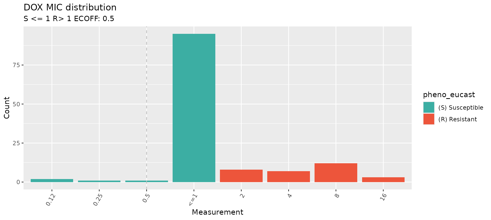
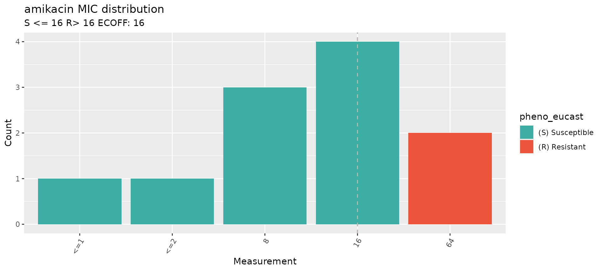
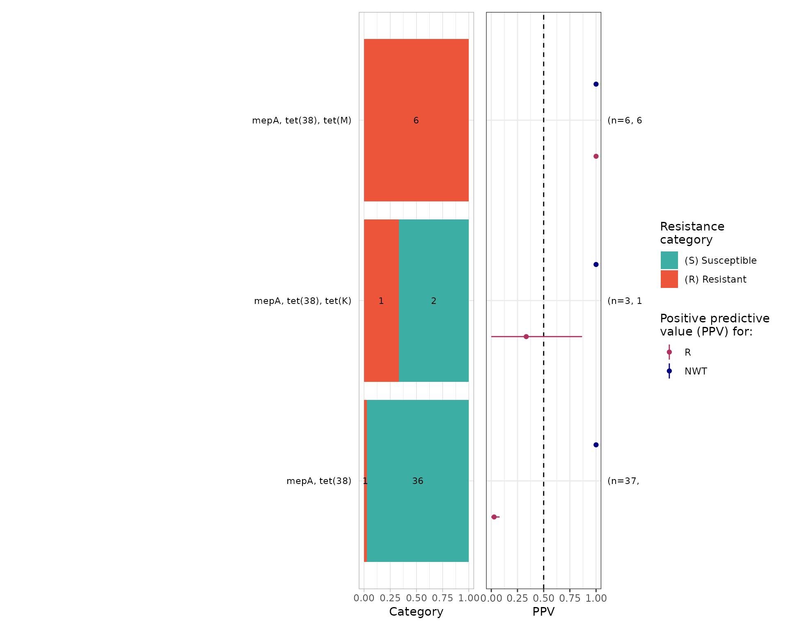

# Download NCBI and EBI Data

## Introduction

This vignette demonstrates how to download antibiotic susceptibility
testing (AST) data from NCBI and EBI, and to re-interpret it using
different clinical breakpoints.

Start by loading the `AMRgen` package:

``` r
library(AMRgen)
library(dplyr)
#> 
#> Attaching package: 'dplyr'
#> The following objects are masked from 'package:stats':
#> 
#>     filter, lag
#> The following objects are masked from 'package:base':
#> 
#>     intersect, setdiff, setequal, union
```

### Option 1: Download data from NCBI

#### Option 1a: Download AST data from NCBI via rentrez

The
[`download_ncbi_ast()`](https://AMRverse.github.io/AMRgen/reference/download_ncbi_ast.md)
function lets you download antibiogram data from NCBI via their ‘EUtils’
API using the rentrez R pacakge. You must specify a species, and can
optionally limit the download to one or more specific drugs. The
function can also re-format the data into an AMRgen phenotype table, and
re-interpret phenotypes against clinical breakpoints from EUCAST or
CLSI.

This function is quite slow, especially for organisms with many
BioSamples to search through, but it is free and requires no
authentication to use. Alternatively, you may prefer to try the BigQuery
functions below (Option 1b), which provide more efficient and complete
access to NCBI data but require authentication via a Google Cloud
account.

``` r
# Download Staphylococcus aureus AST data from NCBI, filtering for amikacin and doxycycline, and re-interpret with EUCAST breakpoints
staph_ast_ncbi <- download_ncbi_ast(
  species = "Staphylococcus aureus",
  antibiotic = c("amikacin", "DOX"), # antibiotics can be listed in short or long form
  reformat = TRUE,
  interpret_eucast = TRUE
) # reformat must be true to use interpret_* argument
```

``` r
# check how many samples retrieved
nrow(staph_ast_ncbi)
#> [1] 143

# check the output
head(staph_ast_ncbi)
#> # A tibble: 6 × 19
#>   id         drug_agent   mic  disk pheno_provided pheno_eucast guideline method
#>   <chr>      <ab>       <mic> <dsk> <sir>          <sir>        <chr>     <chr> 
#> 1 SAMN47875… DOX          <=1    NA   S              S          CLSI      broth…
#> 2 SAMN47875… DOX          <=1    NA   S              S          CLSI      broth…
#> 3 SAMN38228… AMK          <=2    NA   S              S          CLSI      broth…
#> 4 SAMN30333… AMK           NA    21   S              S          CLSI      disk …
#> 5 SAMN20982… AMK           NA    23   S              S          CLSI      disk …
#> 6 SAMN20982… AMK           NA    22   S              S          CLSI      disk …
#> # ℹ 11 more variables: platform <chr>, source <chr>, spp_pheno <mo>,
#> #   `Resistance phenotype` <chr>, `Measurement sign` <chr>, Measurement <chr>,
#> #   `Measurement units` <chr>, Vendor <chr>,
#> #   `Laboratory typing method version or reagent` <chr>,
#> #   pheno_eucast_mic <sir>, pheno_eucast_disk <sir>
```

``` r
# This is the same as downloading the data then re-interpreting it separately:
staph_ast_ncbi_raw <- download_ncbi_ast(
  species = "Staphylococcus aureus",
  antibiotic = c("amikacin", "DOX"),
  reformat = FALSE,
  interpret_eucast = FALSE
)
```

``` r
head(staph_ast_ncbi_raw)
#> # A tibble: 6 × 13
#>   id    BioProject organism Antibiotic `Resistance phenotype` `Measurement sign`
#>   <chr> <chr>      <chr>    <chr>      <chr>                  <chr>             
#> 1 SAMN… PRJNA3915… Staphyl… doxycycli… susceptible            <=                
#> 2 SAMN… PRJNA3915… Staphyl… doxycycli… susceptible            <=                
#> 3 SAMN… PRJNA2788… Staphyl… amikacin   susceptible            <=                
#> 4 SAMN… PRJNA7548… Staphyl… amikacin   susceptible            ==                
#> 5 SAMN… PRJNA7548… Staphyl… amikacin   susceptible            ==                
#> 6 SAMN… PRJNA7548… Staphyl… amikacin   susceptible            ==                
#> # ℹ 7 more variables: Measurement <chr>, `Measurement units` <chr>,
#> #   `Laboratory typing method` <chr>, `Laboratory typing platform` <chr>,
#> #   Vendor <chr>, `Laboratory typing method version or reagent` <chr>,
#> #   `Testing standard` <chr>

# Then reformat and re-interpret using EUCAST and CLSI breakpoints, and ECOFFs using the import_ncbi_biosample() function
staph_ast_ncbi2 <- import_ncbi_biosample(
  input = staph_ast_ncbi_raw,
  interpret_clsi = TRUE,
  interpret_eucast = TRUE,
  interpret_ecoff = TRUE
)
#> Parsing column organism as micro-organism (class 'mo')
#> Renaming column organism to standard name 'spp_pheno'
#> Parsing column Antibiotic as antibiotic (class 'ab')
#> Renaming column Antibiotic to standard name 'drug_agent'
#> Parsing column mic as class 'mic'
#> Parsing column disk as class 'disk'
#> Parsing column pheno_provided as class 'sir'
#> Renaming column Laboratory typing method to standard name 'method'
#> Renaming column Laboratory typing platform to standard name 'platform'
#> Renaming column Testing standard to standard name 'guideline'
#> Renaming column BioProject to standard name 'source'
#> Warning: There was 1 warning in `mutate()`.
#> ℹ In argument: `across(...)`.
#> Caused by warning:
#> ! Some MICs were converted to the nearest higher log2 level, following the
#> CLSI interpretation guideline.

head(staph_ast_ncbi2)
#> # A tibble: 6 × 25
#>   id         drug_agent   mic  disk pheno_provided pheno_eucast pheno_clsi ecoff
#>   <chr>      <ab>       <mic> <dsk> <sir>          <sir>        <sir>      <sir>
#> 1 SAMN47875… DOX          <=1    NA   S              S            S          NI 
#> 2 SAMN47875… DOX          <=1    NA   S              S            S          NI 
#> 3 SAMN38228… AMK          <=2    NA   S              S            NA         WT 
#> 4 SAMN30333… AMK           NA    21   S              S            NA         WT 
#> 5 SAMN20982… AMK           NA    23   S              S            NA         WT 
#> 6 SAMN20982… AMK           NA    22   S              S            NA         WT 
#> # ℹ 17 more variables: guideline <chr>, method <chr>, platform <chr>,
#> #   source <chr>, spp_pheno <mo>, `Resistance phenotype` <chr>,
#> #   `Measurement sign` <chr>, Measurement <chr>, `Measurement units` <chr>,
#> #   Vendor <chr>, `Laboratory typing method version or reagent` <chr>,
#> #   pheno_eucast_mic <sir>, pheno_eucast_disk <sir>, pheno_clsi_mic <sir>,
#> #   pheno_clsi_disk <sir>, ecoff_mic <sir>, ecoff_disk <sir>

# Note that when there is a mix of MIC and disk data, a separate _disk and _mic interpretation column, as well as an overall phenotype column, is produced for each interpretation.
```

This produces a long format data frame, with one row per sample and drug
combination. This is compatible with downstream functions in the AMRgen
package.

Consider altering the `max_records`, `batch_size` or `sleep_time`
options if you want to download a lot of data or run into NCBI server
issues.

#### Option 1b: Download AST and genotype data from NCBI via bigrquery

NCBI data can be accessed via Google Cloud BigQuery. This requires a
Google Cloud account. For more information about using BigQuery to
explore NCBI Pathogen Detection data see
<https://www.ncbi.nlm.nih.gov/pathogens/docs/getting_started_bigquery/>.

The
[`query_ncbi_bq_ast()`](https://AMRverse.github.io/AMRgen/reference/query_ncbi_bq_ast.md)
function lets you download antibiogram data from NCBI via Google Cloud
BigQuery using the bigrquery R pacakge. You must specify a species, and
can optionally limit the download to one or more specific drugs. The
function can also re-format the data into an AMRgen phenotype table, and
re-interpret phenotypes against clinical breakpoints from EUCAST or
CLSI.

This function is fast but requires authentication via a [Google Cloud
account](https://docs.cloud.google.com/docs/get-started) and may require
payment. Free trial accounts can be set up, but require credit card
authorization. Google currently provides enough free tier usage for
\>150 different queries for genotype data per month. To use this you
will also need to install the `bigrquery` package and authorize it to
use your Google cloud account.

``` r
install.packages("bigrquery")
library(bigrquery)
bigrquery::bq_auth()
```

##### To download AST data

``` r
# Download Staphylococcus aureus AST data from NCBI, filtering for amikacin and doxycycline
# NOTE: you may need to add 'PROJECT_ID="xxx"' to the command if you have not set up application default credentials
staph_ast_ncbi_cloud_raw <- query_ncbi_bq_ast(
  taxgroup = "Staphylococcus aureus",
  antibiotic = c("amikacin", "DOX")
)
```

``` r
# Import and reinterpret using CLSI breakpoints
staph_ast_ncbi_cloud <- import_ncbi_ast(staph_ast_ncbi_cloud_raw, interpret_clsi = TRUE)
#> Warning: There was 1 warning in `mutate()`.
#> ℹ In argument: `pheno_provided = as.sir(`Resistance phenotype`)`.
#> Caused by warning:
#> ! in `as.sir()`: 8 results in column 'pheno_provided' truncated (6%) that
#> were invalid antimicrobial interpretations: "intermediate"
```

##### To download genotype data

The
[`query_ncbi_bq_geno()`](https://AMRverse.github.io/AMRgen/reference/query_ncbi_bq_geno.md)
function lets you download AMRfinderplus genotype data, for BioSamples
that have matching AST data, from NCBI via Google Cloud BigQuery using
the bigrquery R pacakge. You must specify a species, and can optionally
limit the download to one or more specific drug classes (see [NCBI AMR
Class-Subclass
Reference](https://github.com/ncbi/amr/wiki/class-subclass) for valid
terms). The function can also re-format the data into an AMRgen genotype
table.

Note that to save memory and disk space BioSamples with no AST data in
NCBI will not be included in the download.

Not all NCBI genotype results are updated with each new release of
AMRfinderplus, so older genomes may have genotype results obtained with
older versions of AMRfinderplus, and newer genomes will have genotype
results obtained with more recent versions.

``` r
# Download Staphylococcus aureus genotype data from NCBI, filtering for variants associated with class 'AMINOGLYCOSIDES' or 'TETRACYCLINES'
# NOTE: you may need to add 'PROJECT_ID="xxx"' to the command if you have not set up application default credentials
staph_geno_ncbi_cloud_raw <- query_ncbi_bq_geno(
  taxgroup = "Staphylococcus aureus",
  geno_class = c("AMINOGLYCOSIDE", "TETRACYCLINE")
) %>% filter(biosample_acc %in% staph_ast_ncbi_cloud_raw$BioSample)
```

``` r
staph_geno_ncbi_cloud_raw
#> # A tibble: 119 × 9
#>    biosample_acc `Gene symbol`   Class Subclass `Element type` `Element subtype`
#>    <chr>         <chr>           <chr> <chr>    <chr>          <chr>            
#>  1 SAMN07291566  mepA            TETR… TIGECYC… AMR            AMR              
#>  2 SAMN04901618  ant(9)-Ia       AMIN… SPECTIN… AMR            AMR              
#>  3 SAMN04901605  mepA            TETR… TIGECYC… AMR            AMR              
#>  4 SAMN04901606  mepA            TETR… TIGECYC… AMR            AMR              
#>  5 SAMN07291567  aac(6')-Ie/aph… AMIN… AMIKACI… AMR            AMR              
#>  6 SAMN07291564  mepA            TETR… TIGECYC… AMR            AMR              
#>  7 SAMN04901609  tet(M)          TETR… TETRACY… AMR            AMR              
#>  8 SAMN07291562  mepA            TETR… TIGECYC… AMR            AMR              
#>  9 SAMN04901615  mepA            TETR… TIGECYC… AMR            AMR              
#> 10 SAMN30333622  ant(9)-Ia       AMIN… SPECTIN… AMR            AMR              
#> # ℹ 109 more rows
#> # ℹ 3 more variables: Method <chr>, Hierarchy_node <chr>, scientific_name <chr>

# Import and parse results into AMRgen genotype table
staph_geno_ncbi_cloud <- import_amrfp(staph_geno_ncbi_cloud_raw, sample_col = "biosample_acc")

staph_geno_ncbi_cloud
#> # A tibble: 148 × 18
#>    biosample_acc gene      mutation drug_agent drug_class `variation type` node 
#>    <chr>         <chr>     <chr>    <ab>       <chr>      <chr>            <chr>
#>  1 SAMN07291566  mepA      NA       TGC        Tetracycl… Gene presence d… mepA 
#>  2 SAMN04901618  ant(9)-Ia NA       SPT        Other      Gene presence d… ant(…
#>  3 SAMN04901605  mepA      NA       TGC        Tetracycl… Gene presence d… mepA 
#>  4 SAMN04901606  mepA      NA       TGC        Tetracycl… Gene presence d… mepA 
#>  5 SAMN07291567  aac(6')-… NA       AMK        Aminoglyc… Gene presence d… aac(…
#>  6 SAMN07291567  aac(6')-… NA       GEN        Aminoglyc… Gene presence d… aac(…
#>  7 SAMN07291567  aac(6')-… NA       KAN        Aminoglyc… Gene presence d… aac(…
#>  8 SAMN07291567  aac(6')-… NA       TOB        Aminoglyc… Gene presence d… aac(…
#>  9 SAMN07291564  mepA      NA       TGC        Tetracycl… Gene presence d… mepA 
#> 10 SAMN04901609  tet(M)    NA       NA         Tetracycl… Gene presence d… tet(…
#> # ℹ 138 more rows
#> # ℹ 11 more variables: marker <chr>, marker.label <chr>, `Gene symbol` <chr>,
#> #   Class <chr>, Subclass <chr>, `Element type` <chr>, `Element subtype` <chr>,
#> #   Method <chr>, Hierarchy_node <chr>, scientific_name <chr>,
#> #   subclass_to_parse <chr>
```

#### Visualise the downloaded phenotype data to check the distribution of the AST data

``` r
# Select one antibiotic at a time
# Specify species and guideline, to annotate with EUCAST breakpoints

# Doxycycline
staph_dox_mic_plot <- assay_by_var(
  pheno_table = staph_ast_ncbi,
  antibiotic = c("DOX"),
  measure = "mic",
  colour_by = "pheno_eucast",
  species = "Staphylococcus aureus",
  guideline = "EUCAST 2024"
)
#>   MIC breakpoints determined using AMR package: S <= 1 and R > 1

staph_dox_mic_plot
```



``` r
# Amikacin
staph_ami_mic_plot <- assay_by_var(
  pheno_table = staph_ast_ncbi,
  antibiotic = c("amikacin"),
  measure = "mic",
  colour_by = "pheno_eucast",
  species = "Staphylococcus aureus",
  guideline = "EUCAST 2024"
)
#>   MIC breakpoints determined using AMR package: S <= 16 and R > 16

staph_ami_mic_plot
```


For more guidance on how to visulaise phenotypic data and combine it
with genotypic data, have a look at the other `AMRgen`
[vignettes](https://amrverse.github.io/AMRgen/articles/AnalysingGenoPhenoData.html).

### Option 2: Download data from EBI

The `download_ebi` function lets you retrieve phenotype or genotype data
(by setting `data ="genotype'`) from the [EBI AMR
Portal](https://www.ebi.ac.uk/amr). Genotypes are called using
AMRfinderplus but processed by EBI. You can optionally filter the
downloaded file to a specified genus or species, and a specific
antibiotic (for phenotype data) or NCBI class/subclass (for genotype
data; check the [NCBI AMR Class-Subclass
Reference](https://github.com/ncbi/amr/wiki/class-subclass) for valid
terms). The function can also reformat and re-interpret the retrieved
results with the breakpoint standards of your choosing.

Note that while NCBI and EBI AST databases have a lot of overlapping
content, they are not identical and each includes biosamples that the
other does not.

``` r
# Download EBI phenotype data for all Staphylococcus, using the same example drugs as above. Reformat and re-interpret using EUCAST breakpoints
staph_ast_ebi <- download_ebi(
  genus = "Staphylococcus",
  antibiotic = c("amikacin", "DOX"),
  reformat = TRUE,
  interpret_eucast = TRUE,
  interpret_clsi = TRUE,
  interpret_ecoff = TRUE
) # chose which guideline to use for re-interpretation. reformat must be TRUE for re-interpretation
```

``` r
# check output
nrow(staph_ast_ebi)
#> [1] 218

length(unique(staph_ast_ebi$id))
#> [1] 190

head(staph_ast_ebi)
#> # A tibble: 6 × 46
#>   id         drug_agent   mic  disk pheno_provided pheno_eucast pheno_clsi ecoff
#>   <chr>      <ab>       <mic> <dsk> <sir>          <sir>        <sir>      <sir>
#> 1 SAMEA6982… AMK           NA    NA   R              NA           NA         NA 
#> 2 SAMEA6985… AMK           NA    NA   R              NA           NA         NA 
#> 3 SAMEA6982… AMK           NA    NA   R              NA           NA         NA 
#> 4 SAMEA6984… AMK           NA    NA   R              NA           NA         NA 
#> 5 SAMEA6984… AMK           NA    NA   R              NA           NA         NA 
#> 6 SAMEA6986… AMK           NA    NA   R              NA           NA         NA 
#> # ℹ 38 more variables: guideline <chr>, method <chr>, platform <chr>,
#> #   source <chr>, spp_pheno <mo>, SRA_accession <chr>, assembly_ID <chr>,
#> #   collection_year <int>, ISO_country_code <chr>, host <chr>, host_age <chr>,
#> #   host_sex <chr>, isolate <chr>, isolation_source <chr>,
#> #   isolation_source_category <chr>, isolation_latitude <chr>,
#> #   isolation_longitude <chr>, genus <chr>, organism <chr>,
#> #   Updated_phenotype_CLSI <chr>, Updated_phenotype_EUCAST <chr>, …
```

Genotype data can be retrieved from EBI using the same function.
Currently, not all samples in the EBI AMR portal have both AST and
genotype data.

Note the input assemblies used to call genotypes, and the version of
AMRfinderplus, in the EBI portal can be different from what’s available
for download from NCBI using the above functions.

``` r
# Download genotype data for Staphylococcus, filter to markers associated with aminoglycosides or tetracyclines, and re-format the data into an AMRgen genotype table. Note that not all samples with phenotype data have genotype data.
staph_geno_ebi <- download_ebi(
  data = "genotype",
  genus = "Staphylococcus",
  geno_class = c("AMINOGLYCOSIDE", "TETRACYCLINE"),
  reformat = T
)
```

``` r
nrow(staph_geno_ebi)
#> [1] 45945

length(unique(staph_geno_ebi$BioSample_ID))
#> [1] 7547

head(staph_geno_ebi)
#> # A tibble: 6 × 34
#>   BioSample_ID gene    mutation node   marker marker.label drug_agent drug_class
#>   <chr>        <chr>   <chr>    <chr>  <chr>  <chr>        <ab>       <chr>     
#> 1 SAMEA5330271 tet(38) -        tet(3… tet(3… tet(38)      NA         Tetracycl…
#> 2 SAMEA5330271 tet(K)  -        tet(K) tet(K) tet(K)       NA         Tetracycl…
#> 3 SAMEA5330271 mepA    -        mepA   mepA   mepA         TGC        Tetracycl…
#> 4 SAMEA5330297 tet(38) -        tet(3… tet(3… tet(38)      NA         Tetracycl…
#> 5 SAMEA5330297 mepA    -        mepA   mepA   mepA         TGC        Tetracycl…
#> 6 SAMEA5330308 tet(K)  -        tet(K) tet(K) tet(K)       NA         Tetracycl…
#> # ℹ 26 more variables: assembly_ID <chr>, genus <chr>, species <chr>,
#> #   organism <chr>, isolate <chr>, taxon_id <int>, region <chr>,
#> #   region_start <int>, region_end <int>, strand <chr>, `_bin` <int>,
#> #   id2 <chr>, gene_symbol <chr>, amr_element_symbol <chr>, element_type <chr>,
#> #   element_subtype <chr>, class <chr>, subclass <chr>, split_subclass <chr>,
#> #   antibiotic_name <chr>, antibiotic_ontology <chr>,
#> #   antibiotic_ontology_link <chr>, evidence_accession <chr>, …
```

#### Compare downloaded phenotypes and genotypes

The downloaded phenotype and genotype data for a specified antibiotic
can then be extracted and combined using the `get_binary_matrix`
function.

``` r
# first filter both EBI pheno and geno dataframes for Staph aureus only
# filter pheno data
staph_ast_ebi_filtered <- staph_ast_ebi %>%
  filter(organism == "Staphylococcus aureus")

# filter geno data
staph_geno_ebi_filtered <- staph_geno_ebi %>%
  filter(species == "Staphylococcus aureus")

# Make binary geno-pheno matrix for doxycycline phenotype (re-interpreted with EUCAST), and genotypes associated with the associated drug class (Tetracyclines)
tet_bin <- get_binary_matrix(
  geno_table = staph_geno_ebi_filtered,
  pheno_table = staph_ast_ebi_filtered,
  antibiotic = "DOX",
  drug_class_list = "Tetracyclines", # matches drug_class in geno_table
  sir_col = "pheno_eucast", # phenotype column in pheno_table
  keep_assay_values = TRUE,
  keep_assay_values_from = "mic"
)
#>  Some samples had multiple phenotype rows, taking the most resistant only for binary matrix
#>  Defining NWT in binary matrix using ecoff column provided: ecoff

nrow(tet_bin)
#> [1] 116

head(tet_bin)
#> # A tibble: 6 × 11
#>   id    pheno ecoff   mic     R   NWT  mepA `tet(38)` `tet(K)` `tet(M)` `tet(L)`
#>   <chr> <sir> <sir> <mic> <dbl> <dbl> <dbl>     <dbl>    <dbl>    <dbl>    <dbl>
#> 1 SAMN…   S     NI    <=1     0    NA     1         1        0        0        0
#> 2 SAMN…   S     NI    <=1     0    NA     1         1        0        0        0
#> 3 SAMN…   S     NI    <=1     0    NA     1         1        0        0        0
#> 4 SAMN…   S     NI    <=1     0    NA     1         1        1        0        0
#> 5 SAMN…   R    NWT      8     1     1     1         1        0        1        0
#> 6 SAMN…   S     NI    <=1     0    NA     1         1        0        0        0
```

``` r
# plot positive predictive value for each marker/combination
tet_ppv <- ppv(tet_bin)
#>  Removing 69 rows with no phenotype call
```


``` r

tet_ppv$plot
```

 This produces a
binary matrix with 1 row per BioSample, for all BioSamples that had both
phenotype data for doxycycline in `staph_ast_ebi_filtered` AND any
genotype data (associated with any marker, not just Tetracyclines) in
`staph_geno_ebi_filtered`. This ensures that we include samples for
which genotyping was performed but returned no hits associated with
Tetracyclines, not just those samples that had tetracycline associated
markers detected (note that such samples would be missing if we had only
downloaded genotype data associated with Tetracyclines).

Columns indicate the input phenotype columns for doxycycline (renamed to
standard fields `pheno`, `ecoff`, `mic`), and binary indicators
(1=present, 0=absent) for doxycycline phenotypes (`R`, `NWT`) and each
genotype marker associated with tetracyclines (in this case `tet(38)`,
`tet(K)`, `tet(M)`,`tet(L)`).

For more examples on how to do join geno-pheno analyses and
visualisations, so the other AMRgen
[Vignettes](https://amrverse.github.io/AMRgen/articles/AnalysingGenoPhenoData.html).
