# Analysing Neisseria gonorrhoeae genotype-phenotype data

## **Introduction**

This vignette demonstrates three usage examples of `AMRgen` functions to
investigate associations between genotype and phenotype data in
*Neisseria gonorrhoeae*. Specifically, we illustrate how to:

- Importing AMR genotype data from AMRFinderPlus.

- Import and format antimicrobial susceptibility testing (AST)
  phenotypic data in the form of minimum inhibitory concentrations
  (MICs) from a table.

- Explore the distribution of phenotypes across observed combinations of
  genetic AMR markers.

- Investigate the statistical association of individual (solo) markers
  and marker combinations with phenotype data.

- Work with MIC data from antibiotics with available EUCAST clinical
  breakpoints and/or epidemiological cut-offs (ECOFF).

- Evaluate the concordance of phenotypes with observed AMR markers and
  predict resistance based on this concordance.

Load the necessary libraries before running this vignette:

``` r
library(AMRgen)
library(AMR)
library(dplyr)
library(tidyr)
library(ggplot2)
```

## **Use case 1:** Investigation of genotype-phenotype AMR data from Euro-GASP genomic surveys

### Data preparation

For this example, we have collated whole-genome sequencing data from
three European Gonococcal Antimicrobial Surveillance Programme
(Euro-GASP) genomic surveys. Raw FASTQ data was downloaded from the
European Nucleotide Archive (ENA).

- Euro-GASP 2013, by [Harris *et al.*
  (2018)](https://doi.org/10.1016/S1473-3099(18)30225-1).
  - ENA [PRJEB9227](https://www.ebi.ac.uk/ena/browser/view/PRJEB9227),
    n=1,054 genomes.
- Euro-GASP 2018, by [Sánchez-Busó *et al.*
  (2022)](https://doi.org/10.1016/S2666-5247(22)00044-1).
  - ENA [PRJEB34068](https://www.ebi.ac.uk/ena/browser/view/PRJEB34068),
    n=2,375 genomes.
- Euro-GASP 2020, by [Golparian *et al.*
  (2024)](https://doi.org/10.1016/S2666-5247(23)00370-1).
  - ENA [PRJEB58139](https://www.ebi.ac.uk/ena/browser/view/PRJEB58139),
    n=1,932 genomes.

Assemblies were generated with
[`SPAdes v3.15.5`](https://doi.org/10.1089/cmb.2012.0021) (`--careful`
mode) and assessed with
[`Quast v5.1`](https://doi.org/10.1093/bioinformatics/btt086). Further
details on the quality control and assembly pipeline used for this data
are described in [Sánchez-Serrano *et al.*
(2026)](https://doi.org/10.1016/j.cmi.2025.12.026).

Phenotypic MIC data were obtained from the respective publications and
collated into a single table (one row per isolate, one column per
antibiotic). This pre-loaded object `eurogasp_pheno_raw` serves as the
**phenotype input** for `AMRgen`:

``` r
head(eurogasp_pheno_raw)
#> # A tibble: 6 × 5
#>   id         Azithromycin Ciprofloxacin Cefixime Ceftriaxone
#>   <chr>             <dbl>         <dbl> <chr>          <dbl>
#> 1 ERR1549755        0.19          8     0.064          0.032
#> 2 ERR1549756        0.25          0.008 0.047          0.023
#> 3 ERR1549757        0.125        32     0.016          0.006
#> 4 ERR1549758        0.38          0.003 0.016          0.003
#> 5 ERR1549759        0.5           0.002 0.016          0.004
#> 6 ERR1471130       NA            NA     0.016          0.012
```

The dataset (total n = 5,361) includes MIC data for:

- Azithromycin (n=5,055 isolates)
- Ciprofloxacin (n=5,360 isolates)
- Cefixime (n=5,361 isolates)
- Ceftriaxone (n=5,361 isolates)

### **Identification of genetic AMR determinants using `AMRfinderplus`**

[`AMRfinderplus v4.0.23`](https://doi.org/10.1038/s41598-021-91456-0)
(database version 2025-03-25.1) was run on all assemblies using the
following command:

``` bash
amrfinder --threads 4 --print_node -O Neisseria_gonorrhoeae --name ${IN%.fasta} -n $IN -o ${IN%.fasta}_amrfp.tsv \
--database /path/to/AMRFinderPlus/databases/4.0/2025-03-25.1
```

> **Note:** The `--print_node` flag must be enabled to include gene
> hierarchy node names in the output.

All per-sample output files were concatenated into a single table:

``` bash
awk 'FNR>1 || NR==1' *_amrfp.tsv > eurogasps_amrfp.tsv
```

This concatenated table is pre-loaded as `eurogasp_geno_raw`, the
**genotype input** for `AMRgen`.

### **Importing genotype and phenotype data into `AMRgen`**

Use
[`import_amrfp()`](https://AMRverse.github.io/AMRgen/reference/import_amrfp.md)
to parse the AMRfinderplus output:

``` r
eurogasp_geno <- import_amrfp(
  input_table = eurogasp_geno_raw,
  sample_col = "Name"
)
```

For the phenotype file, reshape from wide to long format using
[`pivot_longer()`](https://tidyr.tidyverse.org/reference/pivot_longer.html).
MIC values across antibiotics may be stored as different types (numeric
vs. character) due to inequality prefixes such as `<0.016` or `>32`. We
coerce all antibiotic columns to character before pivoting to avoid type
conflicts while preserving this information for downstream processing by
[`format_ast()`](https://AMRverse.github.io/AMRgen/reference/format_ast.md):

``` r
eurogasp_pheno <- eurogasp_pheno_raw %>%
  mutate(across(c(Azithromycin, Ciprofloxacin, Cefixime, Ceftriaxone), as.character)) %>%
  pivot_longer(
    cols = c(Azithromycin, Ciprofloxacin, Cefixime, Ceftriaxone),
    names_to = "antibiotic",
    values_to = "mic"
  )
```

Then format with
[`format_ast()`](https://AMRverse.github.io/AMRgen/reference/format_ast.md).
Setting `interpret_eucast = TRUE` and `interpret_ecoff = TRUE` adds
categorical SIR interpretations (clinical breakpoints) and WT/NWT
classifications (ECOFF) fron EUCAST:

``` r
eurogasp_ast <- format_ast(
  input = eurogasp_pheno,
  sample_col = "id",
  species = "Neisseria gonorrhoeae",
  ab_col = "antibiotic",
  mic_col = "mic",
  interpret_eucast = TRUE,
  interpret_ecoff = TRUE
)
#> Adding new micro-organism column 'spp_pheno' (class 'mo') with constant value Neisseria gonorrhoeae 
#> Parsing column spp_pheno as micro-organism (class 'mo')
#> Parsing column antibiotic as antibiotic (class 'ab')
#> Renaming column antibiotic to standard name 'drug_agent'
#> Parsing column mic as class 'mic'
#> Could not find disk_col disk in input table
#> Could not find pheno_col ecoff in input table
#> Could not find pheno_col pheno_eucast in input table
#> Could not find pheno_col pheno_clsi in input table
#> Could not find pheno_col pheno_provided in input table
#> Could not find method_col method in input table
#> Could not find platform_col platform in input table
#> Could not find guideline_col guideline in input table
#> Could not find source_col source in input table
#> Interpreting all data as species: Neisseria gonorrhoeae
```

Importantly, out of the 5,361 strains under study and with phenotype
data, genetic determinants of AMR were found for 5,186 by AMRfinderplus.
Negative samples should be added to the genotype table so they are
properly accounted for in downstream analyses:

``` r
negative_eurogasp <- eurogasp_pheno_raw %>%
  anti_join(eurogasp_geno, by = c("id" = "Name")) %>%
  pull(id)

eurogasp_geno <- eurogasp_geno %>% bind_rows(tibble(Name = negative_eurogasp))
```

### **Exploring phenotype distributions and comparing with EUCAST reference data**

Round MIC values to the nearest doubling dilution using
[`as.mic()`](https://amr-for-r.org/reference/as.mic.html) with
`round_to_next_log2 = TRUE`:

``` r
eurogasp_double <- eurogasp_ast %>%
  mutate(across(all_of("mic"), ~ AMR::as.mic(.x, round_to_next_log2 = TRUE)))
```

For each antibiotic, we visualise the MIC distribution with
[`assay_by_var()`](https://AMRverse.github.io/AMRgen/reference/assay_by_var.md)
and compare it to the EUCAST reference distribution using
[`compare_mic_with_eucast()`](https://AMRverse.github.io/AMRgen/reference/get_eucast_amr_distribution.md).

#### **Azithromycin**

``` r
# Plot the distribution of MIC data in the study
assay_by_var(
  pheno_table = eurogasp_double,
  antibiotic = "Azithromycin",
  measure = "mic",
  colour_by = "ecoff",
  species = "Neisseria gonorrhoeae"
)
#> Error in executing command: Could not determine MIC breakpoints using AMR package, please provide your own breakpoints
```

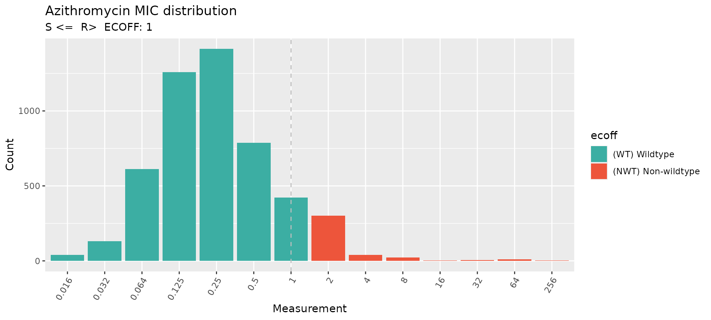

``` r

# Extract MIC data from the pheno table
azm_data <- eurogasp_double %>%
  filter(drug_agent == "AZM") %>%
  pull(mic)
```

``` r
# Compare with a reference distribution from EUCAST
azm_comparison <- compare_mic_with_eucast(
  mics = azm_data,
  ab = "Azithromycin",
  mo = "Neisseria gonorrhoeae"
)

# automated plot comparing to reference distribution
autoplot(azm_comparison)
```

``` r
# Convert the output table into long format
azm_comp_melt <- azm_comparison %>%
  pivot_longer(
    cols = c(user, eucast),
    names_to = "variable",
    values_to = "nb"
  )

# Plot the distributions with ggplot2
ggplot(azm_comp_melt, aes(x = value, y = nb, fill = variable)) +
  geom_bar(stat = "identity", position = "dodge") +
  xlab("Minimum inhibitory concentration (MIC)") +
  ylab("Number of isolates") +
  ggtitle("Azithromycin MIC distribution vs EUCAST reference data") +
  theme(axis.text.x = element_text(angle = 45, hjust = 1))
```

#### **Ciprofloxacin**

``` r
# Plot the distribution of MIC data in the study
# The breakpoint for R is 0.06 but cannot be represented directly as it is not a doubling dilution (values in x axis).
assay_by_var(
  pheno_table = eurogasp_double,
  antibiotic = "Ciprofloxacin",
  measure = "mic",
  colour_by = "pheno_eucast",
  species = "Neisseria gonorrhoeae"
)
#>   MIC breakpoints determined using AMR package: S <= 0.032 and R > 0.06
```

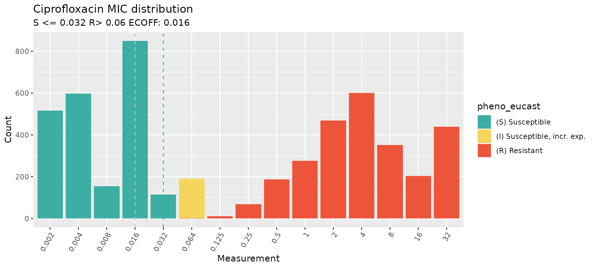

``` r

# If the AST data without doublig dilutions is represented, then both breakpoints can be plotted.
assay_by_var(
  pheno_table = eurogasp_ast,
  antibiotic = "Ciprofloxacin",
  measure = "mic",
  colour_by = "pheno_eucast",
  species = "Neisseria gonorrhoeae"
)
#>   MIC breakpoints determined using AMR package: S <= 0.032 and R > 0.06
```

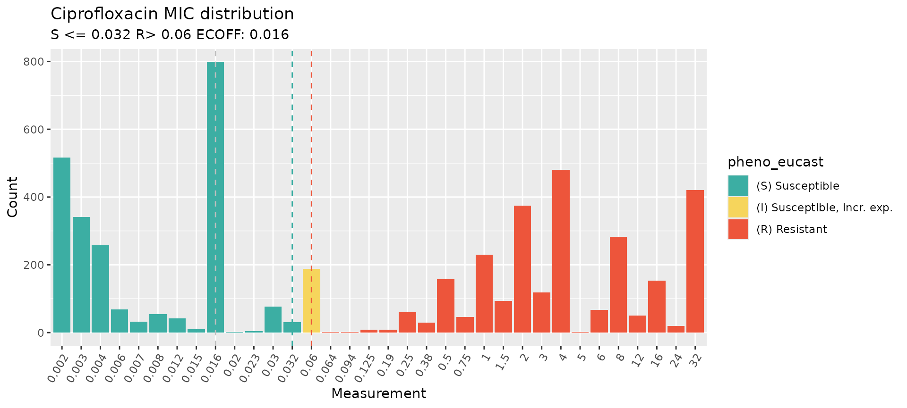

``` r

# Extract MIC data from the pheno table
cip_data <- eurogasp_double %>%
  filter(drug_agent == "CIP") %>%
  pull(mic)
```

``` r
# Compare with a reference distribution from EUCAST
cip_comparison <- compare_mic_with_eucast(
  mics = cip_data,
  ab = "Ciprofloxacin",
  mo = "N. gonorrhoeae"
)

# plot the data with the reference distribution
autoplot(cip_comparison)
```

``` r
# Convert the output table into long format
cip_comp_melt <- cip_comparison %>%
  pivot_longer(
    cols = c(user, eucast),
    names_to = "variable",
    values_to = "nb"
  )

# Plot the distributions with ggplot2
ggplot(cip_comp_melt, aes(x = value, y = nb, fill = variable)) +
  geom_bar(stat = "identity", position = "dodge") +
  xlab("Minimum inhibitory concentration (MIC)") +
  ylab("Number of isolates") +
  ggtitle("Ciprofloxacin MIC distribution vs EUCAST reference data") +
  theme(axis.text.x = element_text(angle = 45, hjust = 1))
```

#### **Ceftriaxone**

``` r
# Plot the distribution of MIC data in the study
assay_by_var(
  pheno_table = eurogasp_double,
  antibiotic = "Ceftriaxone",
  measure = "mic",
  colour_by = "pheno_eucast",
  species = "Neisseria gonorrhoeae"
)
#>   MIC breakpoints determined using AMR package: S <= 0.125 and R > 0.125
```

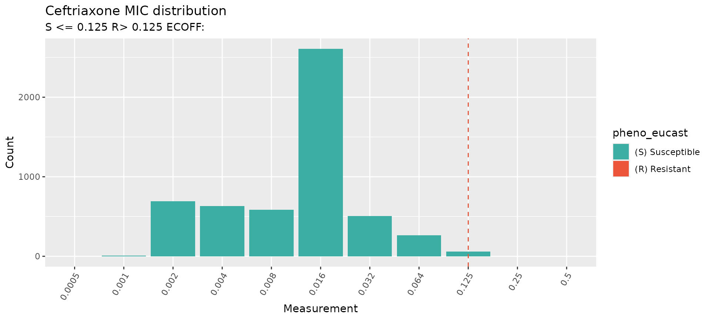

``` r

# Extract MIC data from the pheno table
cro_data <- eurogasp_double %>%
  filter(drug_agent == "CRO") %>%
  pull(mic)
```

``` r
# Compare with a reference distribution from EUCAST
cro_comparison <- compare_mic_with_eucast(
  mics = cro_data,
  ab = "Ceftriaxone",
  mo = "N. gonorrhoeae"
)

autoplot(cro_comparison)
```

``` r
# Convert the output table into long format
cro_comp_melt <- cro_comparison %>%
  pivot_longer(
    cols = c(user, eucast),
    names_to = "variable",
    values_to = "nb"
  )

ggplot(cro_comp_melt, aes(x = value, y = nb, fill = variable)) +
  geom_bar(stat = "identity", position = "dodge") +
  xlab("Minimum inhibitory concentration (MIC)") +
  ylab("Number of isolates") +
  ggtitle("Ceftriaxone MIC distribution vs EUCAST reference data") +
  theme(axis.text.x = element_text(angle = 45, hjust = 1))
```

#### **Cefixime**

``` r
# Plot the distribution of MIC data in the study
assay_by_var(
  pheno_table = eurogasp_double,
  antibiotic = "Cefixime",
  measure = "mic",
  colour_by = "pheno_eucast",
  species = "Neisseria gonorrhoeae"
)
#>   MIC breakpoints determined using AMR package: S <= 0.125 and R > 0.125
```

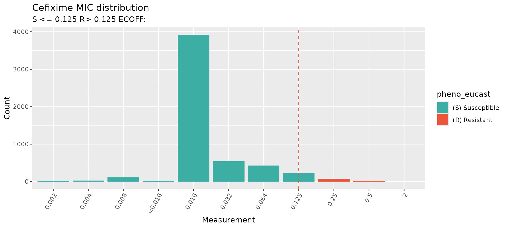

``` r

# Extract MIC data from the pheno table
cfm_data <- eurogasp_double %>%
  filter(drug_agent == "CFM") %>%
  pull(mic)
```

``` r
# Compare with a reference distribution from EUCAST
cfm_comparison <- compare_mic_with_eucast(
  mics = cfm_data,
  ab = "Cefixime",
  mo = "N. gonorrhoeae"
)

autoplot(cfm_comparison)
```

``` r
# Convert the output table into long format and plot using ggplot2
cfm_comp_melt <- cfm_comparison %>%
  pivot_longer(
    cols = c(user, eucast),
    names_to = "variable",
    values_to = "nb"
  )

ggplot(cfm_comp_melt, aes(x = value, y = nb, fill = variable)) +
  geom_bar(stat = "identity", position = "dodge") +
  xlab("Minimum inhibitory concentration (MIC)") +
  ylab("Number of isolates") +
  ggtitle("Cefixime MIC distribution vs EUCAST reference data") +
  theme(axis.text.x = element_text(angle = 45, hjust = 1))
```

### **Analysing azithromycin genotype-phenotype data**

Azithromycin was historically used in dual therapy for gonorrhoea but
has been replaced in many countries by ceftriaxone monotherapy due to
the expansion of resistant lineages. No EUCAST clinical breakpoint
exists for azithromycin in *N. gonorrhoeae*; we therefore use the
epidemiological cut-off (ECOFF \> 1 mg/L).

Build the binary matrix combining genotype and phenotype:

``` r
azm_bin <- get_binary_matrix(
  geno_table = eurogasp_geno,
  pheno_table = eurogasp_ast,
  antibiotic = "Azithromycin",
  drug_class_list = c("Macrolides", "Lincosamides"),
  ecoff_col = "ecoff",
  sir_col = "pheno_eucast",
  keep_assay_values = TRUE,
  keep_assay_values_from = "mic"
)
#>  Defining NWT in binary matrix using ecoff column provided: ecoff
```

Explore the distribution of MIC values across observed marker
combinations with
[`amr_upset()`](https://AMRverse.github.io/AMRgen/reference/amr_upset.md):

``` r
# Calculate upset plots of MIC distributions vs genotype marker combinations
azi_upset <- amr_upset(
  binary_matrix = azm_bin,
  assay = "mic",
  min_set_size = 2,
  order = "value",
  species = "Neisseria gonorrhoeae"
)
#>  Warning: no values in pheno column, colouring upset plot by ecoff column
#>  Removing 306 rows with no phenotype call
```

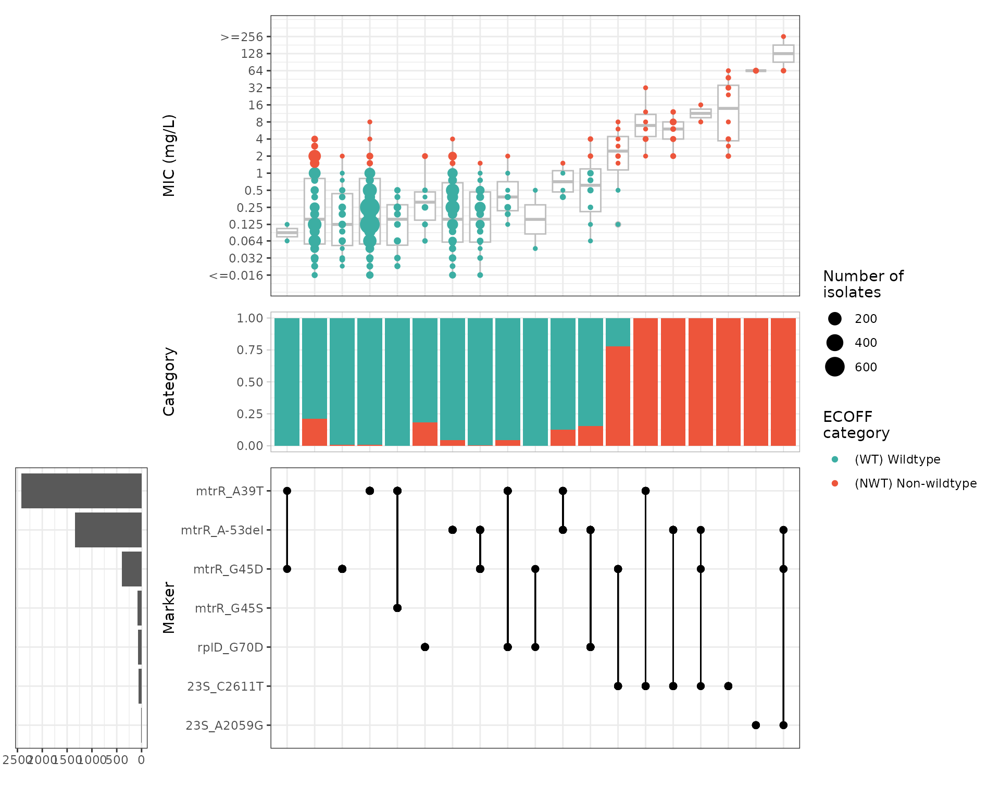

Evaluate the positive predictive value (PPV) of solo markers
(i.e. markers occurring in the absence of any other known AMR
determinant):

``` r
azm_solo_ppv <- solo_ppv_analysis(
  binary_matrix = azm_bin,
  antibiotic = "Azithromycin",
  reverse_order = FALSE
)
```

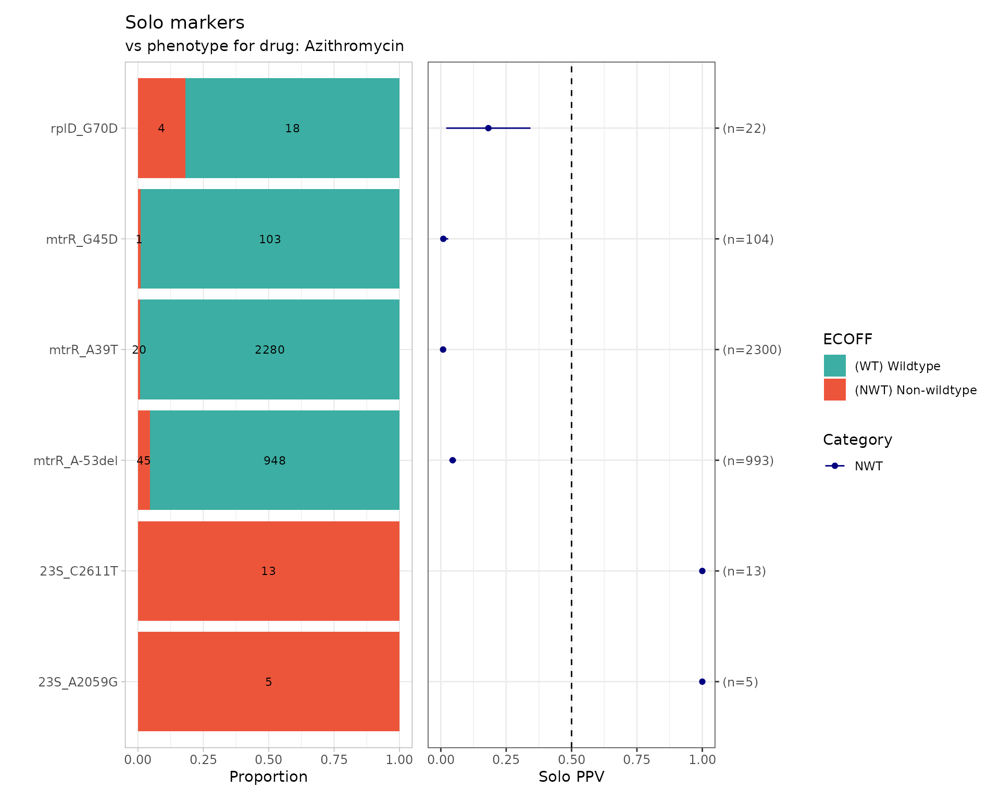

Only known mutations in the *23S* rDNA gene are associated with MIC
increases sufficient to reach the NWT category (ECOFF \> 1 mg/L).
Mutations in the *mtrR* gene or its promoter, or the *rplD* G70D
mutation alone, do not. PPV \> 0.50 indicates that more than 50% of
isolates carrying a given marker fall in the NWT category..

Now evaluate PPVs for marker combinations with
[`ppv()`](https://AMRverse.github.io/AMRgen/reference/ppv.md):

``` r
azm_ppv <- ppv(
  binary_matrix = azm_bin,
  order = "value",
  min_set_size = 2,
  antibiotic = "Azithromycin",
  upset_grid = TRUE,
  plot_assay = TRUE,
  assay = "mic"
)
#>  Warning: no values in pheno column, colouring upset plot by ecoff column
#>  Removing 306 rows with no phenotype call
#> Scale for y is already present.
#> Adding another scale for y, which will replace the existing scale.
```

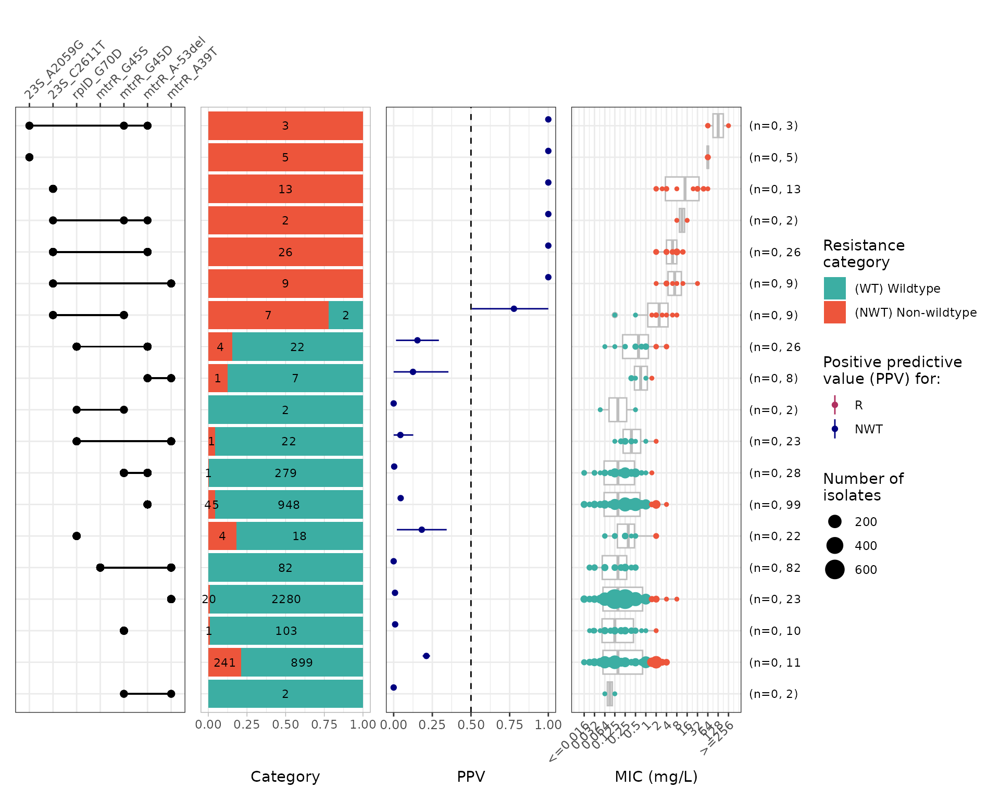

Combinations including *23S* rDNA mutations are the only ones with PPV
\> 0.5. No combination of *mtrR* with or without *rplD* mutations alone
raises MIC above the NWT threshold.

Run a Firth’s bias-reduced penalised-likelihood logistic regression with
[`amr_logistic()`](https://AMRverse.github.io/AMRgen/reference/amr_logistic.md),
including markers with a minimum allele frequency (MAF) of ≥ 10
isolates:

``` r
azm_logist <- amr_logistic(
  binary_matrix = azm_bin,
  antibiotic = "Azithromycin",
  ecoff_col = "ecoff",
  maf = 10,
  single_plot = TRUE
)
#> ...Fitting logistic regression model to R using logistf
#> ...Fitting logistic regression model to NWT using logistf
#>    Filtered data contains 5055 samples (386 => 1, 4669 => 0) and 7 variables.
#> Generating plots
#> Plotting NWT model only
```

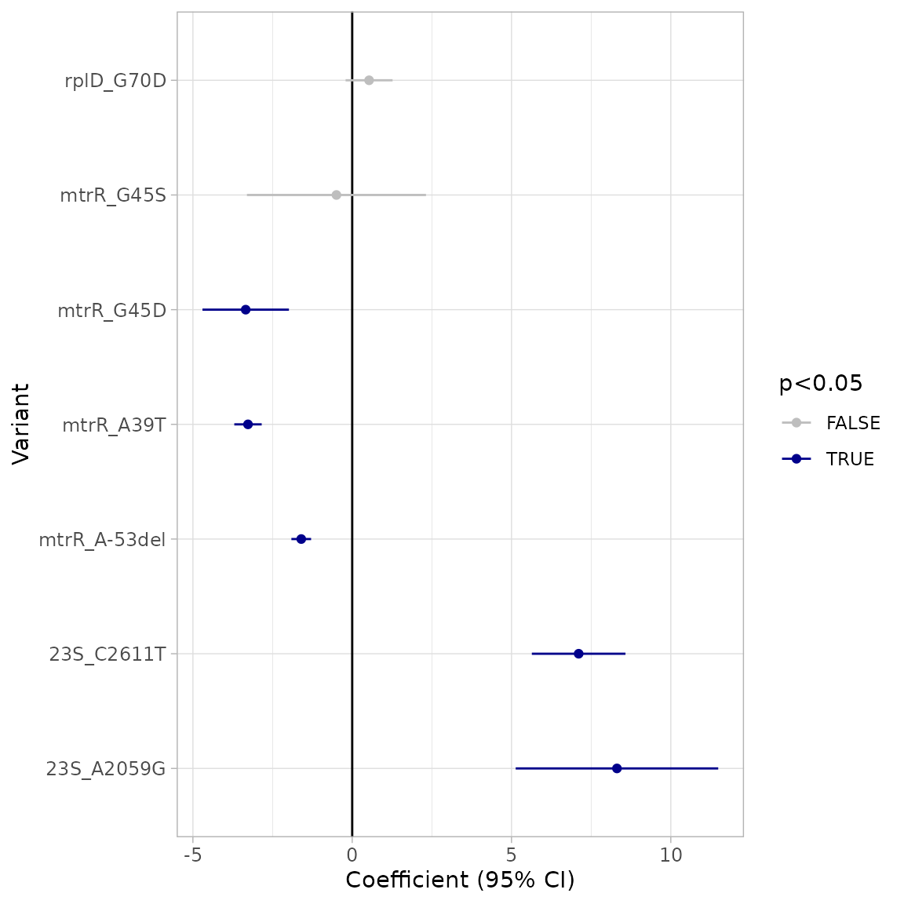

The regression confirms that *mtrR* G45D, A39T, and A-53del do not
contribute to increased azithromycin MICs, while *23S* rDNA mutations
do.

Calculate concordance and resistance prediction metrics using results
from the logistic regression. The results of the `solo_ppv_analisis()`
or [`ppv()`](https://AMRverse.github.io/AMRgen/reference/ppv.md)
functions can be provided to the `ppv_results` parameter.

``` r
azm_concordance <- concordance(
  binary_matrix = azm_bin,
  ppv_results = azm_solo_ppv,
  prediction_rule = "logistic",
  logreg_results = azm_logist
)
azm_concordance
#> AMR Genotype-Phenotype Concordance
#> Prediction rule: logistic
#> 
#> --- Outcome: NWT ---
#> Samples: 5055 | Markers: 10
#> Markers used: mtrR_A39T, mtrR_A-53del, mtrR_G45D, 23S_A2059G, mtrR_G45S, rplD_G70D, erm(B), 23S_C2611T, mtrR_G-131A, mtrC_C-120T
#> 
#> Confusion Matrix:
#>           Truth
#> Prediction    1    0
#>          1   68    2
#>          0  318 4667
#> 
#> Metrics:
#>   Sensitivity : 0.1762
#>   Specificity : 0.9996
#>   PPV         : 0.9714
#>   NPV         : 0.9362
#>   Accuracy    : 0.9367
#>   Kappa       : 0.2814
#>   F-measure   : 0.2982
#>   VME         : 0.8238
#>   ME          : 4e-04
```

The current marker set yields only 17.62% sensitivity (i.e. only 17.62%
of resistant isolates are correctly identified), with a very major error
(VME) of 82.34%. This indicates that the majority of NWT isolates are
not explained by the markers currently available in AMRFinderPlus.
Notably, mosaic variants in the *mtrCDE* efflux pump genes — not yet
fully characterised and represented in AMR databases — are likely
contributing to this discrepancy. Two MtrD mutations associated with
decreased azithromycin susceptibility ([Ma *et al.*,
2020](https://doi.org/10.1128/mbio.01509-20)) have not yet been
incorporated into AMRFinderPlus.

Visualise the prediction on the MIC distribution:

``` r
eurogasp_azm_pred <- eurogasp_ast %>%
  left_join(azm_concordance$data[, c("id", "NWT_pred")], by = "id")

head(eurogasp_azm_pred)
#> # A tibble: 6 × 7
#>   id         drug_agent   mic ecoff pheno_eucast spp_pheno    NWT_pred
#>   <chr>      <ab>       <mic> <sir> <sir>        <mo>            <int>
#> 1 ERR1549755 AZM        0.190   WT    NA         B_NESSR_GNRR        0
#> 2 ERR1549755 CIP        8.000  NWT    R          B_NESSR_GNRR        0
#> 3 ERR1549755 CFM        0.064   NA    S          B_NESSR_GNRR        0
#> 4 ERR1549755 CRO        0.032   NA    S          B_NESSR_GNRR        0
#> 5 ERR1549756 AZM        0.250   WT    NA         B_NESSR_GNRR        0
#> 6 ERR1549756 CIP        0.008   WT    S          B_NESSR_GNRR        0

assay_by_var(
  pheno_table = eurogasp_azm_pred,
  antibiotic = "Azithromycin",
  measure = "mic",
  colour_by = "NWT_pred",
  species = "Neisseria gonorrhoeae",
  bar_cols = c("#3CAEA3", "#ED553B"),
  colour_legend_label = "NWT prediction"
)
#> Error in executing command: Could not determine MIC breakpoints using AMR package, please provide your own breakpoints
```

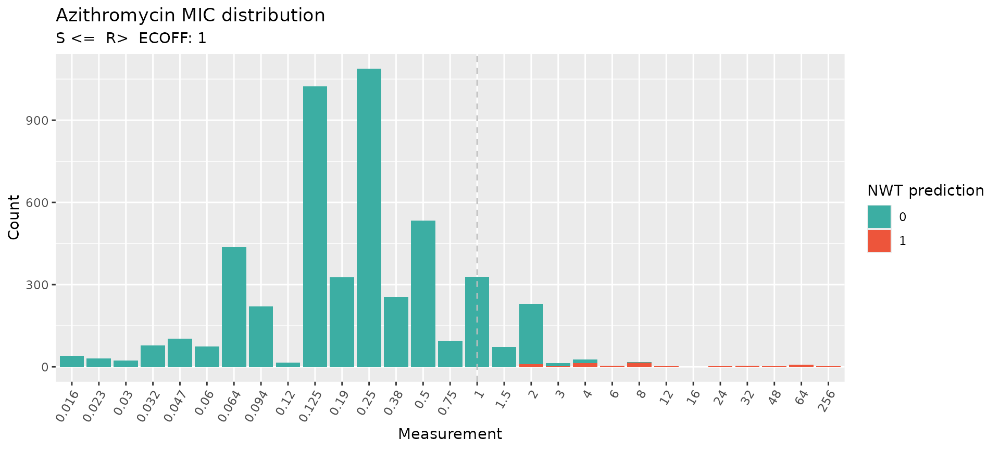

Many isolates with MICs above the ECOFF (1–4 mg/L) are predicted as WT,
consistent with uncharacterised efflux pump variants.

### **Analysing ciprofloxacin genotype-phenotype data**

Ciprofloxacin resistance is widespread in *N. gonorrhoeae* and is
strongly associated with known genetic determinants — primarily
mutations in the *gyrA* and *parC* genes. Build the binary matrix and
generate upset plots:

``` r
# Get binary matrix
cip_bin <- get_binary_matrix(
  geno_table = eurogasp_geno,
  pheno_table = eurogasp_ast,
  antibiotic = "Ciprofloxacin",
  drug_class_list = "Quinolones",
  sir_col = "pheno_eucast",
  keep_assay_values = TRUE,
  keep_assay_values_from = "mic"
)
#>  Defining NWT in binary matrix using ecoff column provided: ecoff

# Calculate upset plots of MIC distributions vs genotype marker combinations
cip_upset <- amr_upset(
  binary_matrix = cip_bin,
  min_set_size = 1,
  order = "value",
  assay = "mic",
  antibiotic = "Ciprofloxacin",
  species = "Neisseria gonorrhoeae"
)
#>  Removing 336 rows with no phenotype call
#>   MIC breakpoints determined using AMR package: S <= 0.032 and R > 0.06
#>   MIC breakpoints determined using AMR package: S <= 0.032 and R > 0.06
```

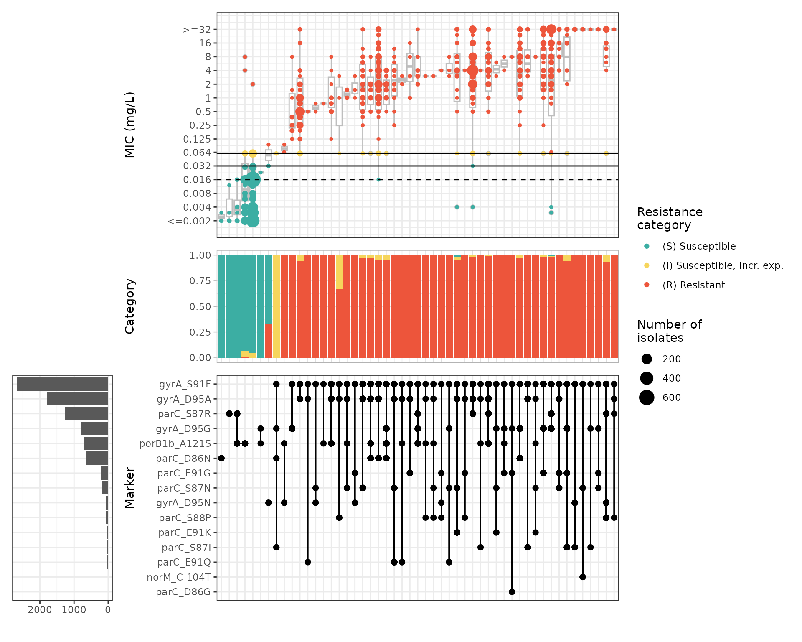

The upset plot shows that most isolates with an MIC above the EUCAST
clinical breakpoint (R) carry the *gyrA* S91F mutation, the principal
driver of ciprofloxacin resistance. Horizontal black lines in the top
panel indicate clinical breakpoints; the dashed line represents the
ECOFF.

Only four markers appear in isolation; evaluate their solo PPVs:

``` r
cip_solo_ppv <- solo_ppv_analysis(
  binary_matrix = cip_bin,
  antibiotic = "Ciprofloxacin",
  reverse_order = FALSE
)
```

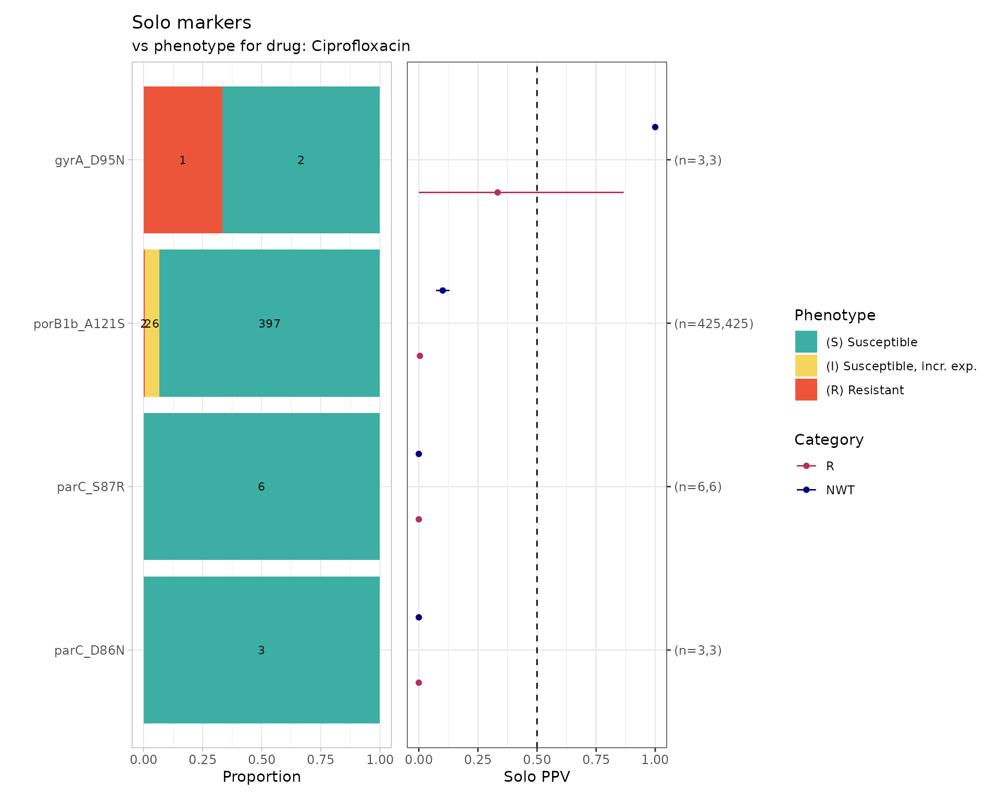

Evaluate PPVs for marker combinations:

``` r
cip_ppv <- ppv(
  binary_matrix = cip_bin,
  order = "value",
  min_set_size = 2,
  antibiotic = "Ciprofloxacin",
  upset_grid = TRUE,
  plot_assay = TRUE,
  assay = "mic"
)
#>  Removing 336 rows with no phenotype call
#> Scale for y is already present.
#> Adding another scale for y, which will replace the existing scale.
```

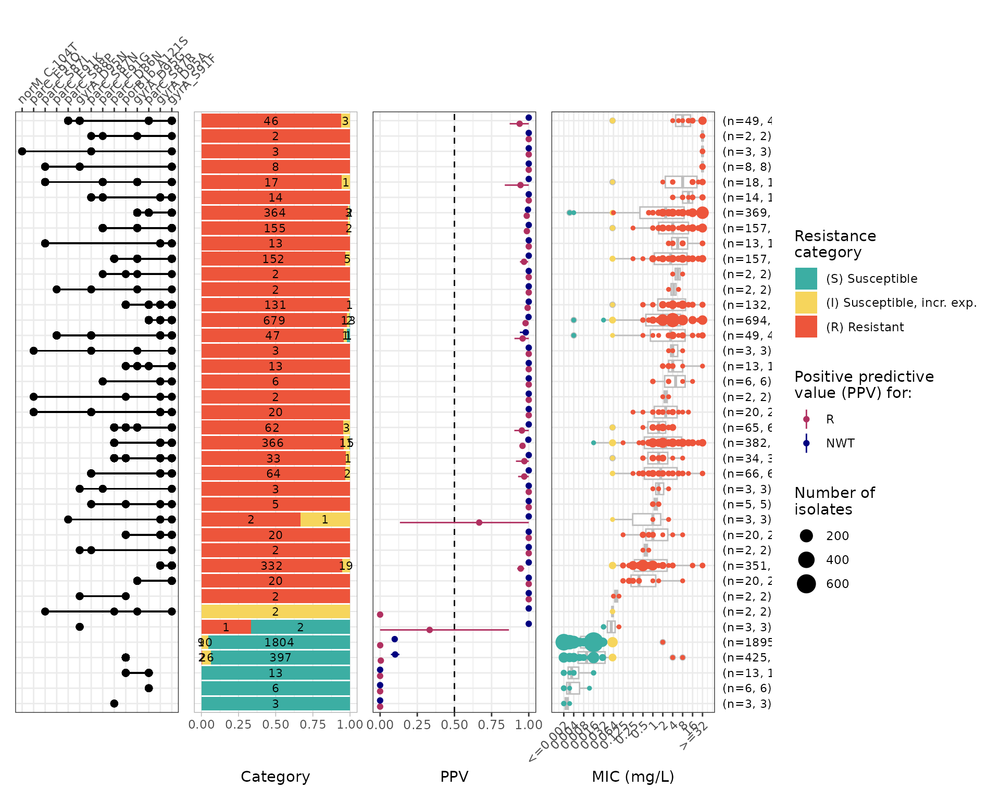

Run logistic regression to assess the individual contribution of each
marker:

``` r
cip_logist <- amr_logistic(
  binary_matrix = cip_bin,
  antibiotic = "Ciprofloxacin",
  sir_col = "pheno_eucast",
  ecoff_col = "ecoff",
  maf = 10,
  single_plot = TRUE
)
#> ...Fitting logistic regression model to R using logistf
#>    Filtered data contains 5025 samples (2605 => 1, 2420 => 0) and 13 variables.
#> ...Fitting logistic regression model to NWT using logistf
#>    Filtered data contains 5025 samples (2907 => 1, 2118 => 0) and 13 variables.
#> Generating plots
#> Plotting 2 models
```

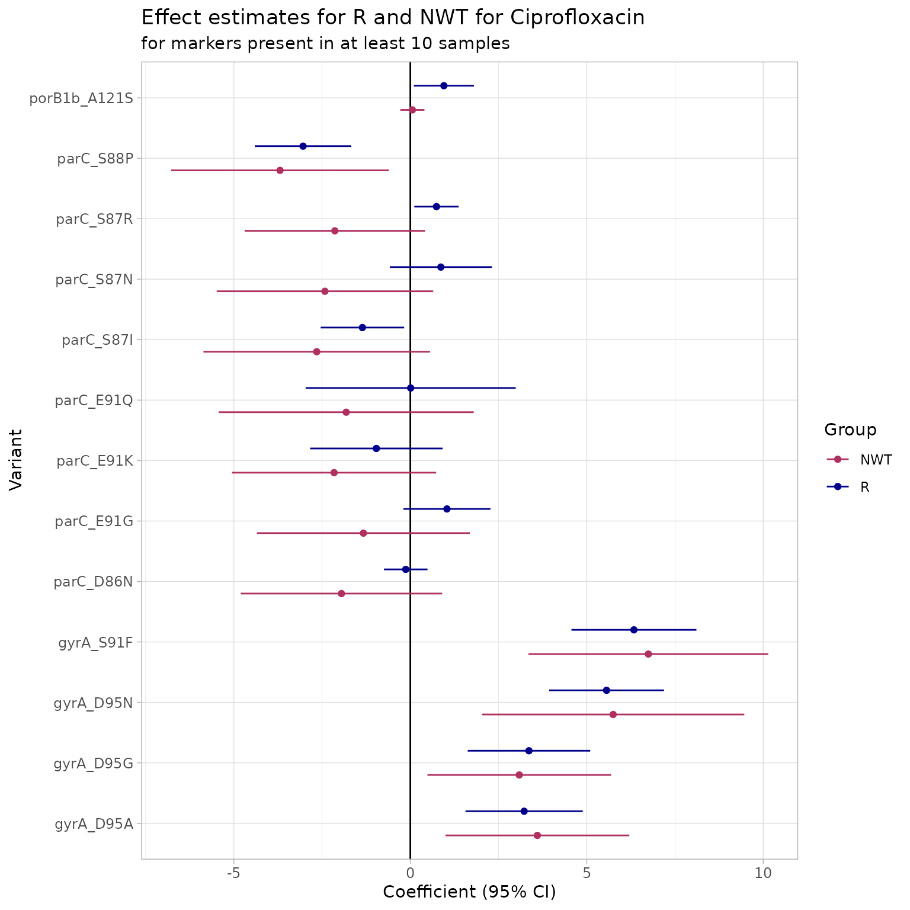

Calculate concordance metrics using the results from the logistic
regression:

``` r
cip_concordance <- concordance(
  binary_matrix = cip_bin,
  ppv_results = cip_solo_ppv,
  prediction_rule = "logistic",
  logreg_results = cip_logist
)
cip_concordance
#> AMR Genotype-Phenotype Concordance
#> Prediction rule: logistic
#> 
#> --- Outcome: R ---
#> Samples: 5025 | Markers: 15
#> Markers used: porB1b_A121S, gyrA_D95A, gyrA_S91F, parC_S87R, parC_D86N, gyrA_D95G, parC_E91G, parC_E91Q, parC_S87N, norM_C-104T, parC_E91K, gyrA_D95N, parC_S87I, parC_S88P, parC_D86G
#> 
#> Confusion Matrix:
#>           Truth
#> Prediction    1    0
#>          1 2601   78
#>          0    4 2342
#> 
#> Metrics:
#>   Sensitivity : 0.9985
#>   Specificity : 0.9678
#>   PPV         : 0.9709
#>   NPV         : 0.9983
#>   Accuracy    : 0.9837
#>   Kappa       : 0.9673
#>   F-measure   : 0.9845
#>   VME         : 0.0015
#>   ME          : 0.0322
#> 
#> --- Outcome: NWT ---
#> Samples: 5025 | Markers: 15
#> Markers used: porB1b_A121S, gyrA_D95A, gyrA_S91F, parC_S87R, parC_D86N, gyrA_D95G, parC_E91G, parC_E91Q, parC_S87N, norM_C-104T, parC_E91K, gyrA_D95N, parC_S87I, parC_S88P, parC_D86G
#> 
#> Confusion Matrix:
#>           Truth
#> Prediction    1    0
#>          1 2678    5
#>          0  229 2113
#> 
#> Metrics:
#>   Sensitivity : 0.9212
#>   Specificity : 0.9976
#>   PPV         : 0.9981
#>   NPV         : 0.9022
#>   Accuracy    : 0.9534
#>   Kappa       : 0.9059
#>   F-measure   : 0.9581
#>   VME         : 0.0788
#>   ME          : 0.0024
```

- Using `R` as outcome, we get a 99.85% sensitivity, 96.55% specificity
  and a PPV of 97.09% using all markers, with a major error (ME, a
  susceptible isolate is reported as resistant) of 3.45% and a very
  major error (VME, a resistant isolate is reported as susceptible) of
  ~0%.

- Using `NWT` as outcome, we get a 92.34% sensitivity, 99.75%
  specificity and a PPV of 99.81%, with a ME of ~0% but a VME of 7.67%.

The results from the concordance analysis contain a prediction of R/NWT
based on the genotype-phenotype comparison under `$data` in the
generated object `cip_concordance`. Extract these prediction columns,
named `R_pred` and/or `NWT_pred`, and incorporate them into the
`eurogasp_ast` object, which contains the MIC distribution for this
antibiotic:

``` r
eurogasp_cip_pred <- eurogasp_ast %>%
  left_join(cip_concordance$data[, c("id", "R_pred", "NWT_pred")],
    by = "id"
  )

head(eurogasp_cip_pred)
#> # A tibble: 6 × 8
#>   id         drug_agent   mic ecoff pheno_eucast spp_pheno    R_pred NWT_pred
#>   <chr>      <ab>       <mic> <sir> <sir>        <mo>          <int>    <int>
#> 1 ERR1549755 AZM        0.190   WT    NA         B_NESSR_GNRR      1        1
#> 2 ERR1549755 CIP        8.000  NWT    R          B_NESSR_GNRR      1        1
#> 3 ERR1549755 CFM        0.064   NA    S          B_NESSR_GNRR      1        1
#> 4 ERR1549755 CRO        0.032   NA    S          B_NESSR_GNRR      1        1
#> 5 ERR1549756 AZM        0.250   WT    NA         B_NESSR_GNRR      0        0
#> 6 ERR1549756 CIP        0.008   WT    S          B_NESSR_GNRR      0        0
```

Visualise the distribution of ciprofloxacin MICs by the R/NWT
predictions:

``` r
assay_by_var(
  pheno_table = eurogasp_cip_pred,
  antibiotic = "Ciprofloxacin",
  measure = "mic",
  colour_by = "R_pred",
  species = "Neisseria gonorrhoeae",
  bar_cols = c("#3CAEA3", "#ED553B"),
  colour_legend_label = "R prediction"
)
#>   MIC breakpoints determined using AMR package: S <= 0.032 and R > 0.06

assay_by_var(
  pheno_table = eurogasp_cip_pred,
  antibiotic = "Ciprofloxacin",
  measure = "mic",
  colour_by = "NWT_pred",
  species = "Neisseria gonorrhoeae",
  bar_cols = c("#3CAEA3", "#ED553B"),
  colour_legend_label = "NWT prediction"
)
#>   MIC breakpoints determined using AMR package: S <= 0.032 and R > 0.06
```

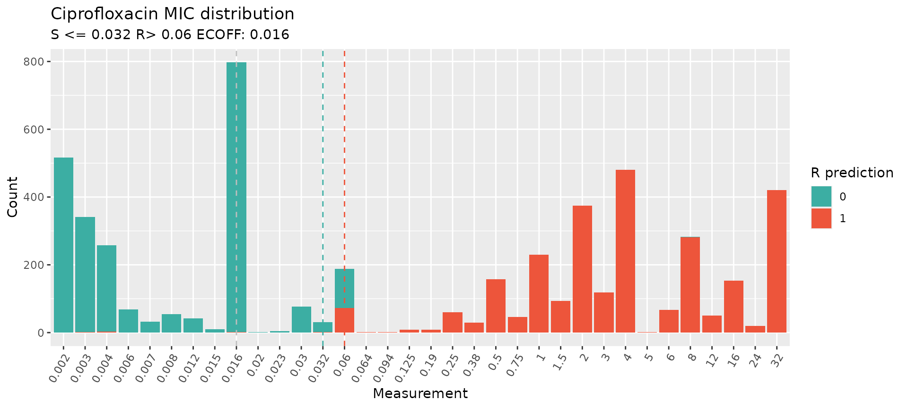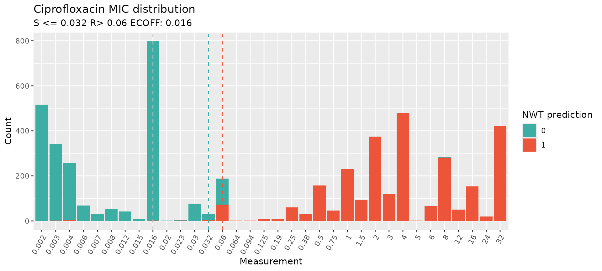

Results demonstrate a very strong genotype-based prediction of
ciprofloxacin resistance/susceptibility using the currently available
AMR markers.

#### Analysing **extended-spectrum cephalosporin** genotype-phenotype data

Euro-GASP provides MIC data for both ceftriaxone (first-line monotherapy
for gonorrhoea) and cefixime (historically used but largely discarded
due to expansion of *penA* mosaics generated through homologous
recombination with other *Neisseria* species).

Build binary matrices for each antibiotic:

``` r
cfm_bin <- get_binary_matrix(
  geno_table = eurogasp_geno,
  pheno_table = eurogasp_ast,
  antibiotic = "Cefixime",
  drug_class_list = "Cephalosporins (3rd gen.)",
  sir_col = "pheno_eucast",
  ecoff_col = "ecoff",
  keep_assay_values = TRUE,
  keep_assay_values_from = "mic"
)
#>  Defining NWT in binary matrix using ecoff column provided: ecoff

cro_bin <- get_binary_matrix(
  geno_table = eurogasp_geno,
  pheno_table = eurogasp_ast,
  antibiotic = "Ceftriaxone",
  drug_class_list = "Cephalosporins (3rd gen.)",
  sir_col = "pheno_eucast",
  ecoff_col = "ecoff",
  keep_assay_values = TRUE,
  keep_assay_values_from = "mic"
)
#>  Defining NWT in binary matrix using ecoff column provided: ecoff
```

Generate upset plots:

``` r
cfm_upset <- amr_upset(
  binary_matrix = cfm_bin,
  min_set_size = 1,
  order = "value",
  assay = "mic",
  antibiotic = "Cefixime",
  species = "Neisseria gonorrhoeae"
)
#>   MIC breakpoints determined using AMR package: S <= 0.125 and R > 0.125
#>   MIC breakpoints determined using AMR package: S <= 0.125 and R > 0.125
```

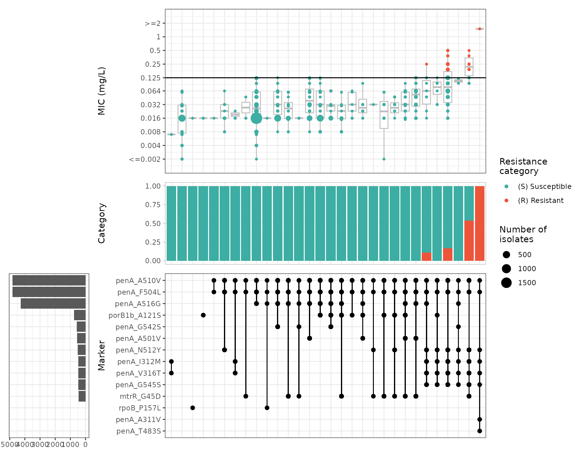

``` r

cro_upset <- amr_upset(
  binary_matrix = cro_bin,
  min_set_size = 1,
  order = "value",
  assay = "mic",
  antibiotic = "Ceftriaxone",
  species = "Neisseria gonorrhoeae"
)
#>   MIC breakpoints determined using AMR package: S <= 0.125 and R > 0.125
#>   MIC breakpoints determined using AMR package: S <= 0.125 and R > 0.125
```

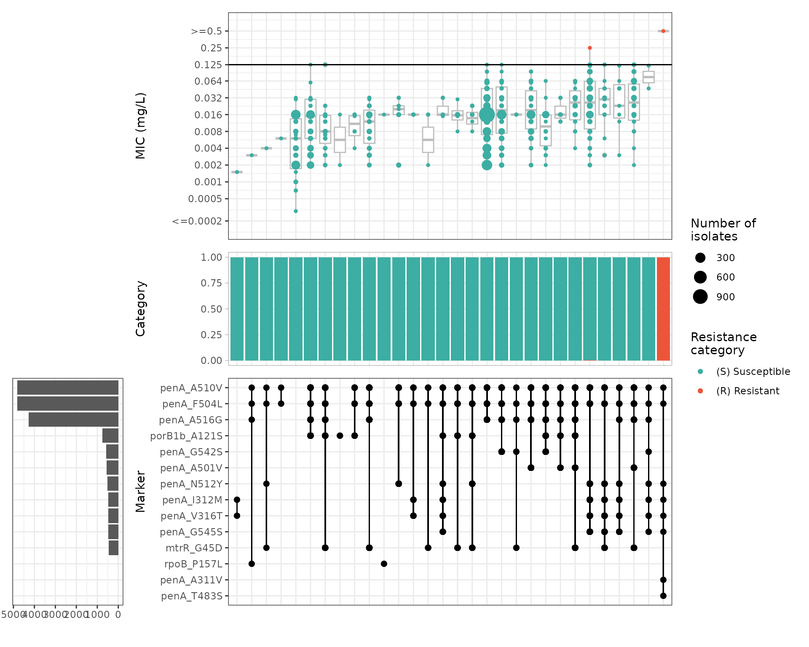

Several mutations in *penA* are associated with increased MICs, however
only particular combinations of mutations lead to MICs above the
resistant breakpoint. This is very characteristic of *penA* mosaics
generated through homologous recombination with other *Neisseria*
species. Importantly, not all mosaics increase the MIC above the
clinical breakpoint, resulting in a wide MIC range within the
susceptible category.

Because most known cephalosporin resistance mutations appear in
combination, solo marker analysis provides limited information in this
case:

``` r
cfm_solo_ppv <- solo_ppv_analysis(
  binary_matrix = cfm_bin,
  antibiotic = "Cefixime",
  drug_class_list = "Cephalosporins (3rd gen.)",
  sir_col = "pheno_eucast"
)
```

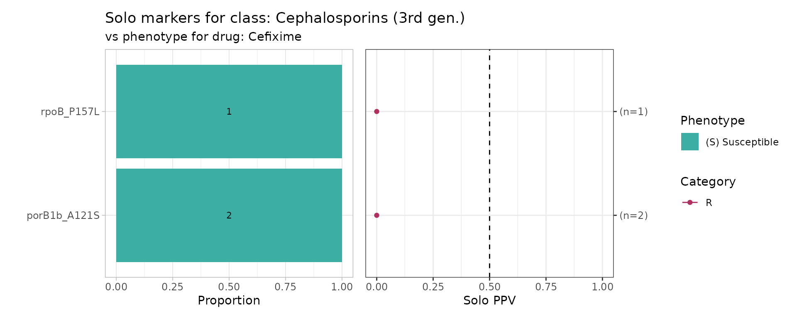

``` r

cro_solo_ppv <- solo_ppv_analysis(
  binary_matrix = cro_bin,
  antibiotic = "Ceftriaxone",
  drug_class_list = "Cephalosporins (3rd gen.)",
  sir_col = "pheno_eucast"
)
```

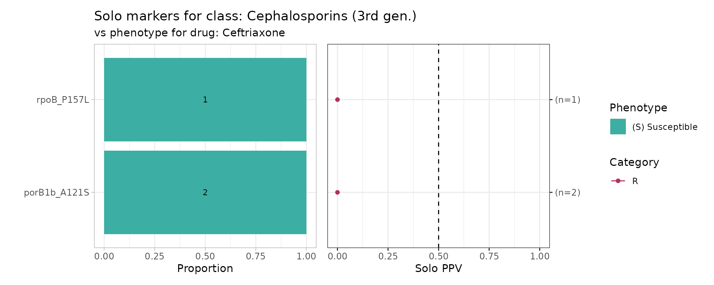

Instead, combination PPVs are a more informative metric:

``` r
cfm_ppv <- ppv(
  binary_matrix = cfm_bin,
  min_set_size = 2,
  order = "ppv",
  upset_grid = TRUE,
  plot_assay = TRUE,
  assay = "mic"
)
#> Scale for y is already present.
#> Adding another scale for y, which will replace the existing scale.
```

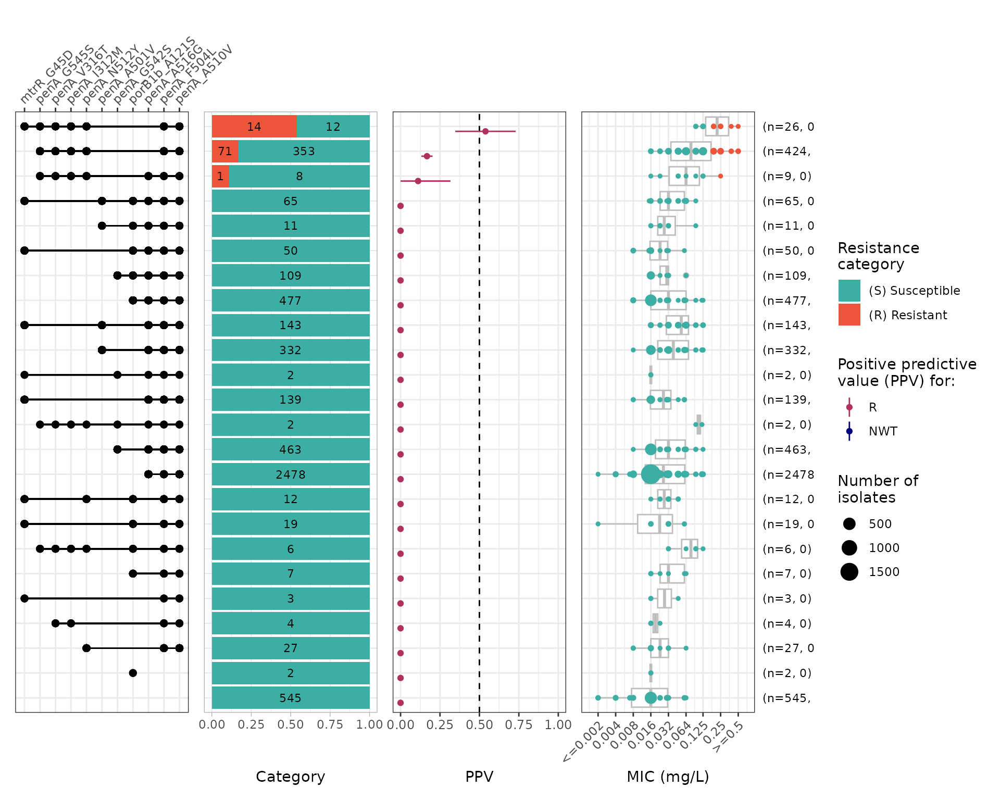

``` r

cro_ppv <- ppv(
  binary_matrix = cro_bin,
  min_set_size = 1,
  order = "ppv",
  upset_grid = TRUE,
  plot_assay = TRUE,
  assay = "mic"
)
#> Scale for y is already present.
#> Adding another scale for y, which will replace the existing scale.
```

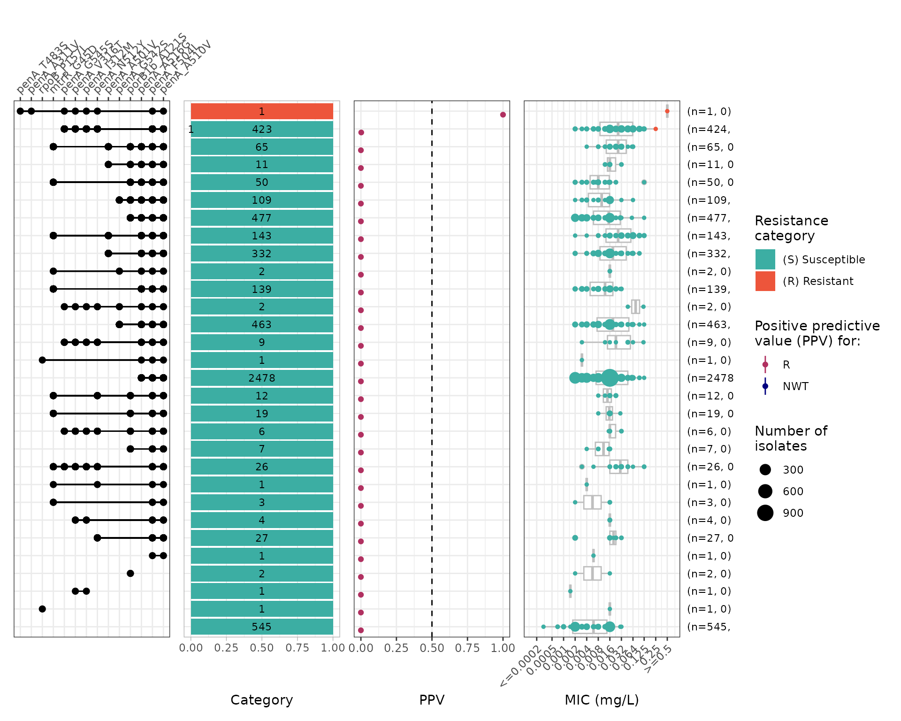

Due to the very limited number of isolates classified as resistant to
cefixime or ceftriaxone in this dataset, logistic regression analyses
are not feasible here.

## **Use case 2:** Study of mosaic PBP2 mutations associated with decreased susceptibility and resistance to ceftriaxone

In this use case, we explore combinations of PBP2 mutations and their
associated MIC ranges for mosaic *penA* variants, using a broader
dataset that enriches for ceftriaxone-resistant and
decreased-susceptibility isolates. The dataset combines AMRFinderPlus
results from the following sources (total n = 2,101 genomes):

- Euro-GASP 2020 genomic survey by [Golparian *et al.*
  (2024)](https://doi.org/10.1016/S2666-5247(23)00370-1).
  - ENA [PRJEB58139](https://www.ebi.ac.uk/ena/browser/view/PRJEB58139),
    n=1,932 genomes.
- Ceftriaxone-resistant gonococci from the United Kingdom, by [Day *et
  al.* (2022)](https://doi.org/10.2807/1560-7917.ES.2022.27.46.2200803).
  - ENA [PRJEB57389](https://www.ebi.ac.uk/ena/browser/view/PRJEB57389),
    n=8 genomes.
- Ceftriaxone-resistant gonococci from England, by [Fifer *et al.*
  (2024)](https://doi.org/10.1093/jac/dkae369).
  - ENA [PRJEB76977](https://www.ebi.ac.uk/ena/browser/view/PRJEB76977),
    n=19 genomes.
- Ceftriaxone-resistant gonoccci from Asia, by [van der Veen *et al.*
  2026](https://doi.org/10.1093/cid/ciaf530).
  - ENA [PRJEB45627](https://www.ebi.ac.uk/ena/browser/view/PRJEB45627),
    [PRJNA577446](https://www.ebi.ac.uk/ena/browser/view/PRJNA577446),
    [PRJNA776899](https://www.ebi.ac.uk/ena/browser/view/PRJNA776899),
    [PRJNA778600](https://www.ebi.ac.uk/ena/browser/view/PRJNA778600),
    [PRJNA560592](https://www.ebi.ac.uk/ena/browser/view/PRJNA560592),
    [PRJNA874857](https://www.ebi.ac.uk/ena/browser/view/PRJNA874857),
    [PRJNA909328](https://www.ebi.ac.uk/ena/browser/view/PRJNA909328),
    [PRJNA957547](https://www.ebi.ac.uk/ena/browser/view/PRJNA957547),
    [PRJNA1161034](https://www.ebi.ac.uk/ena/browser/view/PRJNA1161034),
    [PRJNA1189294](https://www.ebi.ac.uk/ena/browser/view/PRJNA1189294),
    n=113 genomes.
- World Health Organization (WHO) reference genomes, by [Unemo *et al.*
  (2024)](https://doi.org/10.1093/jac/dkae176).
  - ENA
    [PRJNA1067895](https://www.ebi.ac.uk/ena/browser/view/PRJNA1067895),
    n=29 genomes.

Import and format the data:

``` r
# Genotype file
ngono_cro_geno <- import_amrfp(ngono_cro_geno_raw, "Name")
#> Input file lacks the expected column: 'Type' (v4.0+) or 'Element type' (pre-v4), assuming all rows report AMR markers.

# Phenotype file
ngono_cro_pheno <- ngono_cro_pheno_raw %>%
  pivot_longer(
    cols = c(Ceftriaxone),
    names_to = "antibiotic",
    values_to = "mic"
  )

ngono_cro_ast <- format_ast(
  input = ngono_cro_pheno,
  sample_col = "id",
  species = "Neisseria gonorrhoeae",
  ab_col = "antibiotic",
  mic_col = "mic",
  interpret_eucast = TRUE
)
#> Adding new micro-organism column 'spp_pheno' (class 'mo') with constant value Neisseria gonorrhoeae 
#> Parsing column spp_pheno as micro-organism (class 'mo')
#> Parsing column antibiotic as antibiotic (class 'ab')
#> Renaming column antibiotic to standard name 'drug_agent'
#> Parsing column mic as class 'mic'
#> Could not find disk_col disk in input table
#> Could not find pheno_col ecoff in input table
#> Could not find pheno_col pheno_eucast in input table
#> Could not find pheno_col pheno_clsi in input table
#> Could not find pheno_col pheno_provided in input table
#> Could not find method_col method in input table
#> Could not find platform_col platform in input table
#> Could not find guideline_col guideline in input table
#> Could not find source_col source in input table
#> Interpreting all data as species: Neisseria gonorrhoeae

# Include empty rows for samples with phenotype but no genotype data
negative_cro <- ngono_cro_pheno_raw %>%
  anti_join(ngono_cro_geno, by = c("id" = "Name")) %>%
  pull(id)

ngono_cro_geno <- ngono_cro_geno %>% bind_rows(tibble(Name = negative_cro))
```

Build the binary matrix and generate upset plots:

``` r
# Get binary matrix
cro_bin_2 <- get_binary_matrix(
  geno_table = ngono_cro_geno,
  pheno_table = ngono_cro_ast,
  antibiotic = "Ceftriaxone",
  drug_class_list = "Cephalosporins (3rd gen.)",
  sir_col = "pheno_eucast",
  keep_assay_values = TRUE,
  keep_assay_values_from = "mic"
)
#>  Defining NWT in binary matrix as I/R vs S, as no ECOFF column defined

# Calculate upset plots of MIC vs genotype marker combinations
cro_upset_2 <- amr_upset(
  binary_matrix = cro_bin_2,
  min_set_size = 1,
  order = "value",
  assay = "mic",
  antibiotic = "Ceftriaxone",
  species = "Neisseria gonorrhoeae"
)
#>   MIC breakpoints determined using AMR package: S <= 0.125 and R > 0.125
#>   MIC breakpoints determined using AMR package: S <= 0.125 and R > 0.125
```

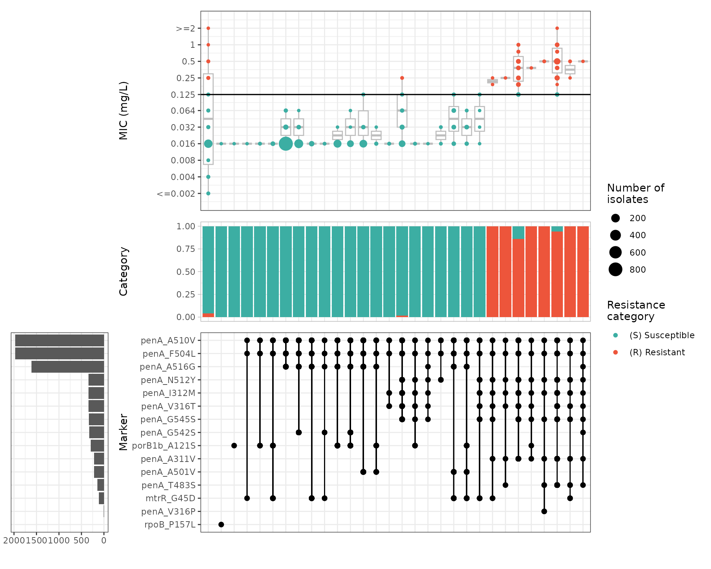

Calculate combination PPVs:

``` r
cro_ppv_2 <- ppv(
  binary_matrix = cro_bin_2,
  min_set_size = 1,
  order = "ppv",
  upset_grid = TRUE,
  plot_assay = TRUE,
  assay = "mic"
)
#> Scale for y is already present.
#> Adding another scale for y, which will replace the existing scale.
```

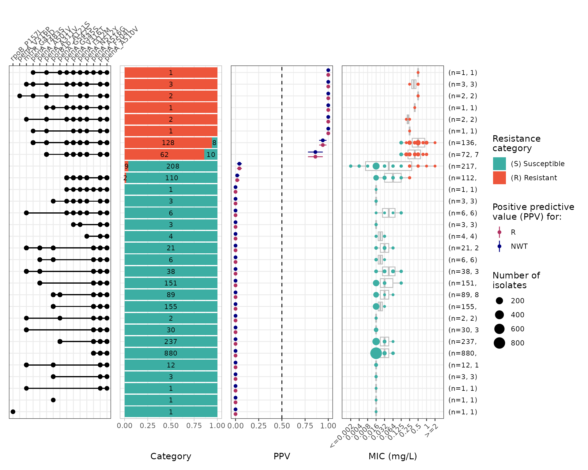

Run logistic regression to evaluate individual marker contributions:

``` r
cro_logist <- amr_logistic(
  binary_matrix = cro_bin_2,
  antibiotic = "Ceftriaxone",
  sir_col = "pheno_eucast",
  ecoff_col = "ecoff",
  fit_glm = TRUE,
  maf = 10,
  single_plot = TRUE
)
#> ...Fitting logistic regression model to R using glm
#>    Filtered data contains 2191 samples (211 => 1, 1980 => 0) and 13 variables.
#> Waiting for profiling to be done...
#> ...Fitting logistic regression model to NWT using glm
#>    Filtered data contains 2191 samples (211 => 1, 1980 => 0) and 13 variables.
#> Waiting for profiling to be done...
#> Generating plots
#> Plotting 2 models
```

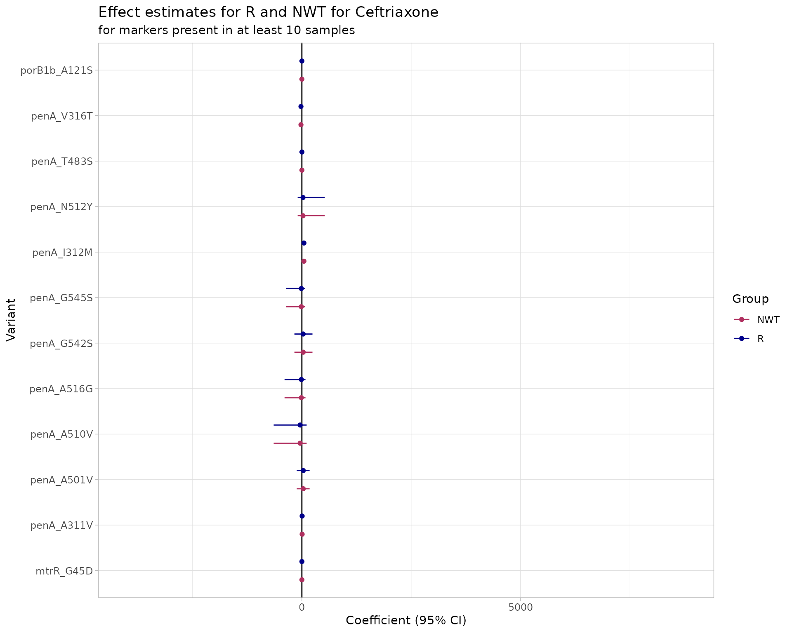

Results confirm that individual *penA* mutations do not independently
increase cephalosporin MICs; rather, specific combinations of mutations
are required. *penA* I312M has a very wide coefficient interval, likely
reflecting their contribution to *penA* mosaics associated with
resistance.

## **Use case 3:** Investigation of tetracycline resistance and implications for STI prevention strategies

Doxy-PEP (doxycycline post-exposure prophylaxis) involves taking a
single dose of doxycycline within 24–72 hours after a sexual risk event
to prevent STIs. While evidence supports its short-term efficacy, a
modelling study by [Reichert *et al.*
(2026)](https://www.thelancet.com/journals/lanmic/article/PIIS2666-5247(24)00168-X/fulltext)
suggests that broad doxy-PEP implementation may select resistant
lineages, potentially limiting its long-term effectiveness against
gonorrhoea.

Here, we analyse 409 *N. gonorrhoeae* genomes from isolates collected in
eastern Spain between 2021–2024 ([Sánchez-Serrano *et al.*,
2026](https://doi.org/10.1016/j.cmi.2025.12.026), ENA
[PRJEB83795](https://www.ebi.ac.uk/ena/browser/view/PRJEB83795)), with
available tetracycline MIC data, to explore genetic determinants of
tetracycline resistance in a local gonococcal population.

Import and format phenotype data:

``` r
ngono_tet_pheno <- ngono_tet_pheno_raw %>%
  pivot_longer(
    cols = c(Tetracycline),
    names_to = "antibiotic",
    values_to = "mic"
  )

ngono_tet_ast <- format_ast(
  input = ngono_tet_pheno,
  sample_col = "id",
  species = "Neisseria gonorrhoeae",
  ab_col = "antibiotic",
  mic_col = "mic",
  interpret_eucast = TRUE,
  interpret_ecoff = TRUE
)
#> Adding new micro-organism column 'spp_pheno' (class 'mo') with constant value Neisseria gonorrhoeae 
#> Parsing column spp_pheno as micro-organism (class 'mo')
#> Parsing column antibiotic as antibiotic (class 'ab')
#> Renaming column antibiotic to standard name 'drug_agent'
#> Parsing column mic as class 'mic'
#> Could not find disk_col disk in input table
#> Could not find pheno_col ecoff in input table
#> Could not find pheno_col pheno_eucast in input table
#> Could not find pheno_col pheno_clsi in input table
#> Could not find pheno_col pheno_provided in input table
#> Could not find method_col method in input table
#> Could not find platform_col platform in input table
#> Could not find guideline_col guideline in input table
#> Could not find source_col source in input table
#> Interpreting all data as species: Neisseria gonorrhoeae
```

Import genotype data and add empty rows for samples with phenotype
information but for which no genetic AMR determinants are identified by
AMRfinderplus. For this example, there are 409 samples with MIC in the
phenotype file but AMR determinants were only found for 402.

``` r
ngono_tet_geno <- import_amrfp(
  input_table = ngono_tet_geno_raw,
  sample_col = "Name"
)

negative_samples <- ngono_tet_ast %>%
  anti_join(ngono_tet_geno, by = c("id" = "Name")) %>%
  pull(id)

ngono_tet_geno <- ngono_tet_geno %>% bind_rows(tibble(Name = negative_samples))
```

Build the binary matrix and generate upset plots:

``` r
tet_bin <- get_binary_matrix(
  geno_table = ngono_tet_geno,
  pheno_table = ngono_tet_ast,
  antibiotic = "Tetracycline",
  drug_class_list = "Tetracyclines",
  ecoff_col = "ecoff",
  sir_col = "pheno_eucast",
  keep_assay_values = TRUE,
  keep_assay_values_from = "mic"
)
#>  Defining NWT in binary matrix using ecoff column provided: ecoff

tet_upset <- amr_upset(
  binary_matrix = tet_bin,
  assay = "mic",
  min_set_size = 2,
  order = "value",
  bp_R = 0.5,
  plot_set_size = TRUE,
  print_set_size = TRUE,
  print_category_counts = TRUE
)
```

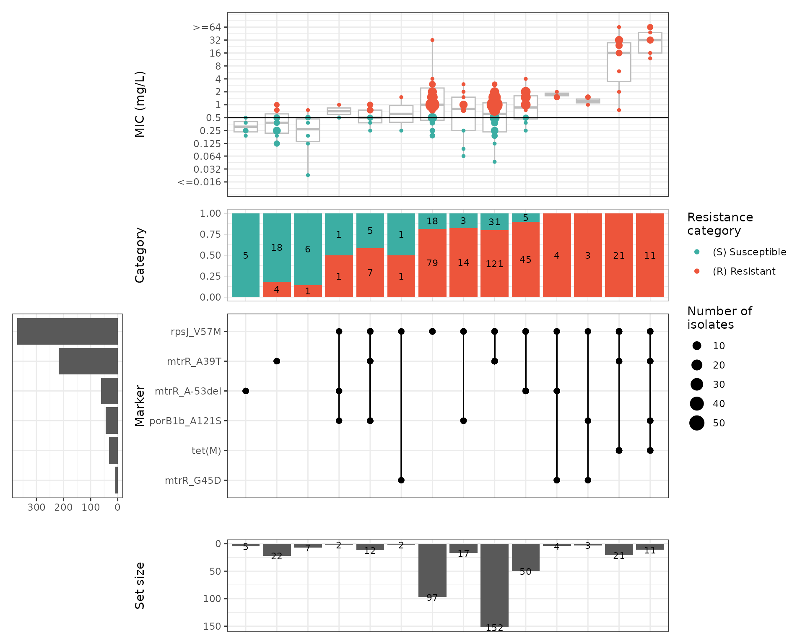

The upset plot shows that MIC increases are primarily explained by the
chromosomal *rpsJ* V57M mutation and the *tet(M)* gene, which is carried
on a conjugative plasmid.

Calculate prevalence of the two key resistance determinants in the
studied population:

``` r
pop_size <- 409

ngono_tet_geno %>%
  count(marker) %>%
  filter(marker %in% c("rpsJ_V57M", "tet(M)")) %>%
  mutate(percent = round(100 * n / pop_size, 1))
#> # A tibble: 2 × 3
#>   marker        n percent
#>   <chr>     <int>   <dbl>
#> 1 rpsJ_V57M   373    91.2
#> 2 tet(M)       34     8.3
```

Of the 409 isolates with tetracycline phenotypic data:

- **373 (91.2%)** carry the *rpsJ* V57M chromosomal mutation.

- **34 (8.3%)** carry the *tet(M)* gene on the conjugative plasmid.

Explore marker combinations in the upset summary:

``` r
tet_upset$summary %>%
  arrange(desc(marker_count)) %>%
  filter(grepl("rpsJ_V57M", marker_list))
#> # A tibble: 13 × 21
#>    marker_list          marker_count     n combination_id   R.n R.ppv R.ci_lower
#>    <chr>                       <dbl> <int> <fct>          <dbl> <dbl>      <dbl>
#>  1 mtrR_A39T, rpsJ_V57…            4    11 1_1_1_1_0_0       11 1          1    
#>  2 rpsJ_V57M, mtrR_A-5…            3     4 0_1_0_0_1_1        4 1          1    
#>  3 rpsJ_V57M, porB1b_A…            3     3 0_1_0_1_0_1        3 1          1    
#>  4 rpsJ_V57M, porB1b_A…            3     2 0_1_0_1_1_0        1 0.5        0    
#>  5 rpsJ_V57M, tet(M), …            3     1 0_1_1_0_1_0        1 1          1    
#>  6 mtrR_A39T, rpsJ_V57…            3    12 1_1_0_1_0_0        7 0.583      0.304
#>  7 mtrR_A39T, rpsJ_V57…            3    21 1_1_1_0_0_0       21 1          1    
#>  8 rpsJ_V57M, mtrR_G45D            2     2 0_1_0_0_0_1        1 0.5        0    
#>  9 rpsJ_V57M, mtrR_A-5…            2    50 0_1_0_0_1_0       45 0.9        0.817
#> 10 rpsJ_V57M, porB1b_A…            2    17 0_1_0_1_0_0       14 0.824      0.642
#> 11 rpsJ_V57M, tet(M)               2     1 0_1_1_0_0_0        1 1          1    
#> 12 mtrR_A39T, rpsJ_V57M            2   152 1_1_0_0_0_0      121 0.796      0.732
#> 13 rpsJ_V57M                       1    97 0_1_0_0_0_0       79 0.814      0.737
#> # ℹ 14 more variables: R.ci_upper <dbl>, R.denom <int>, NWT.n <dbl>,
#> #   NWT.ppv <dbl>, NWT.ci_lower <dbl>, NWT.ci_upper <dbl>, NWT.denom <int>,
#> #   median_excludeRangeValues <dbl>, q25_excludeRangeValues <dbl>,
#> #   q75_excludeRangeValues <dbl>, n_excludeRangeValues <int>,
#> #   median_ignoreRanges <dbl>, q25_ignoreRanges <dbl>, q75_ignoreRanges <dbl>

tet_upset$summary %>%
  arrange(desc(marker_count)) %>%
  filter(grepl("tet\\(M\\)", marker_list))
#> # A tibble: 4 × 21
#>   marker_list           marker_count     n combination_id   R.n R.ppv R.ci_lower
#>   <chr>                        <dbl> <int> <fct>          <dbl> <dbl>      <dbl>
#> 1 mtrR_A39T, rpsJ_V57M…            4    11 1_1_1_1_0_0       11     1          1
#> 2 rpsJ_V57M, tet(M), m…            3     1 0_1_1_0_1_0        1     1          1
#> 3 mtrR_A39T, rpsJ_V57M…            3    21 1_1_1_0_0_0       21     1          1
#> 4 rpsJ_V57M, tet(M)                2     1 0_1_1_0_0_0        1     1          1
#> # ℹ 14 more variables: R.ci_upper <dbl>, R.denom <int>, NWT.n <dbl>,
#> #   NWT.ppv <dbl>, NWT.ci_lower <dbl>, NWT.ci_upper <dbl>, NWT.denom <int>,
#> #   median_excludeRangeValues <dbl>, q25_excludeRangeValues <dbl>,
#> #   q75_excludeRangeValues <dbl>, n_excludeRangeValues <int>,
#> #   median_ignoreRanges <dbl>, q25_ignoreRanges <dbl>, q75_ignoreRanges <dbl>
```

Calculate PPVs for marker combinations:

``` r
tet_ppv <- ppv(
  binary_matrix = tet_bin,
  min_set_size = 1,
  order = "ppv",
  upset_grid = TRUE,
  plot_assay = TRUE,
  assay = "mic"
)
#> Scale for y is already present.
#> Adding another scale for y, which will replace the existing scale.
```

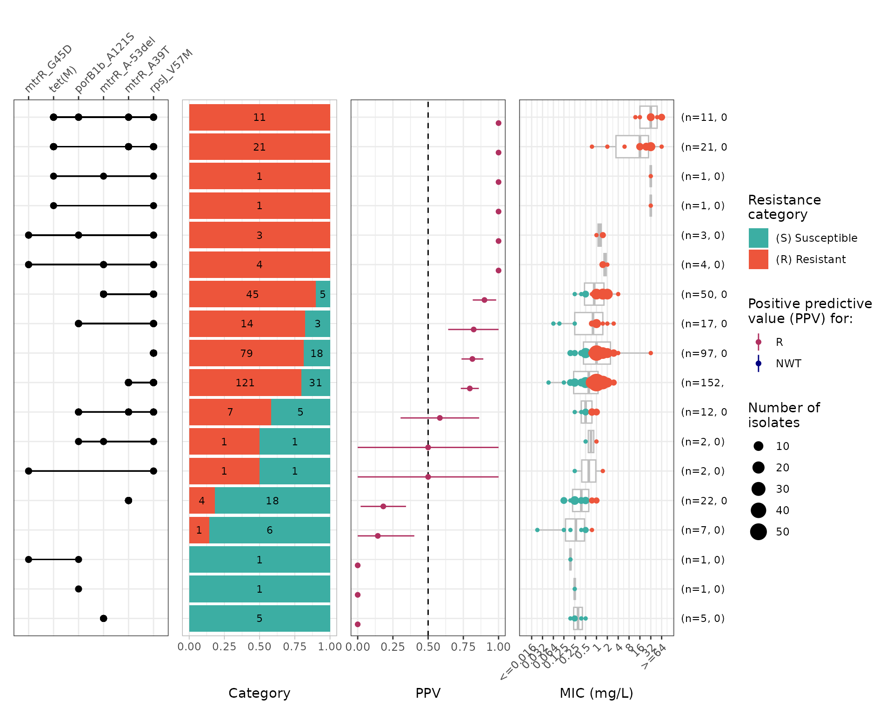

Run logistic regression to confirm the independent contributions of
*rpsJ* V57M and *tet(M)*:

``` r
tet_logist <- amr_logistic(
  binary_matrix = tet_bin,
  antibiotic = "Tetracycline",
  drug_class_list = "Tetracyclines",
  sir_col = "pheno_eucast",
  ecoff_col = "ecoff",
  maf = 10,
  single_plot = TRUE
)
#> ...Fitting logistic regression model to R using logistf
#>    Filtered data contains 409 samples (314 => 1, 95 => 0) and 6 variables.
#> ...Fitting logistic regression model to NWT using logistf
#> Generating plots
#> Plotting R model only
```

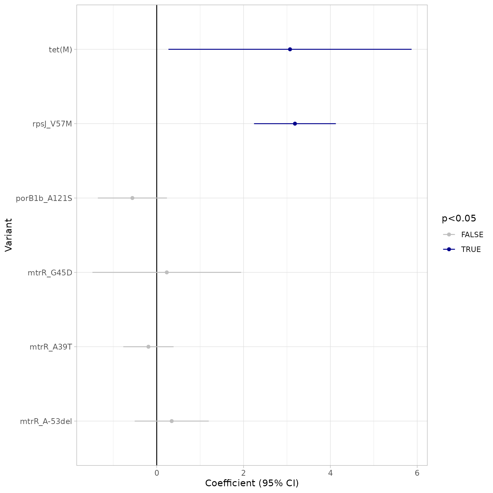

As there is no ECOFF defined for tetracycline in *N. gonorrhoeae*, we
use only clinical breakpoints (`truth = "R"`) in the concordance
analysis:

``` r
tet_concordance <- concordance(
  binary_matrix = tet_bin,
  ppv_results = tet_ppv,
  prediction_rule = "logistic",
  logreg_results = tet_logist,
  truth = "R"
)
tet_concordance
#> AMR Genotype-Phenotype Concordance
#> Prediction rule: logistic
#> 
#> --- Outcome: R ---
#> Samples: 409 | Markers: 6
#> Markers used: mtrR_A39T, rpsJ_V57M, tet(M), porB1b_A121S, mtrR_A-53del, mtrR_G45D
#> 
#> Confusion Matrix:
#>           Truth
#> Prediction   1   0
#>          1 309  64
#>          0   5  31
#> 
#> Metrics:
#>   Sensitivity : 0.9841
#>   Specificity : 0.3263
#>   PPV         : 0.8284
#>   NPV         : 0.8611
#>   Accuracy    : 0.8313
#>   Kappa       : 0.3962
#>   F-measure   : 0.8996
#>   VME         : 0.0159
#>   ME          : 0.6737
```

The current marker set achieves 98.72% sensitivity and 82.84% PPV, but
only 28.09 % specificity. This is reflected in a high major error rate
(ME = 71.91%), meaning many susceptible isolates are predicted as
resistant — a consequence of the very high prevalence of *rpsJ* V57M in
isolates that have elevated MICs but remain below the clinical
breakpoint.

Visualise the predictions on the MIC distribution:

``` r
ngono_tet_pred <- ngono_tet_ast %>%
  left_join(tet_concordance$data[, c("id", "R_pred")],
    by = "id"
  )

assay_by_var(
  pheno_table = ngono_tet_pred,
  antibiotic = "Tetracycline",
  measure = "mic",
  colour_by = "R_pred",
  species = "Neisseria gonorrhoeae",
  bar_cols = c("#3CAEA3", "#ED553B"),
  colour_legend_label = "R prediction"
)
#>   MIC breakpoints determined using AMR package: S <= 0.5 and R > 0.5
```

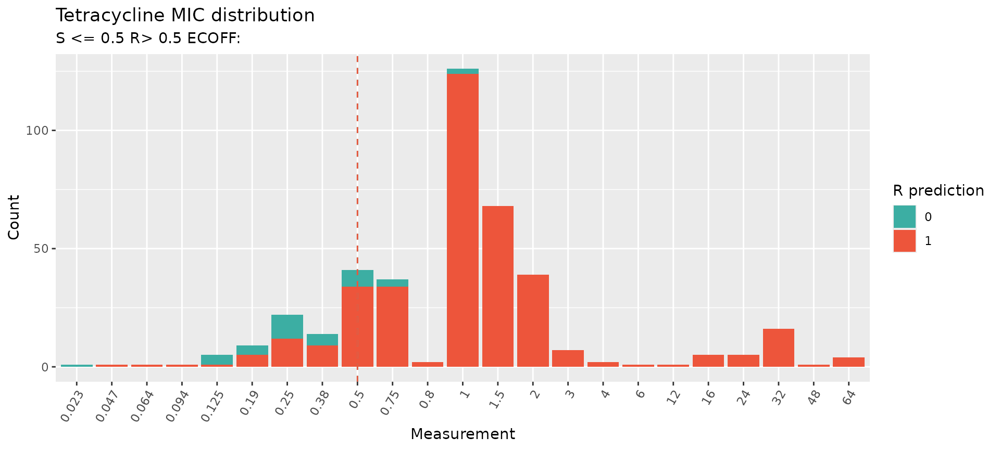

The high prevalence of *rpsJ* V57M (\>90% of the population) combined
with a significant prevalence of the plasmid-borne *tet(M)* gene — which
can be readily acquired by other circulating lineages through
conjugation — means that doxy-PEP is likely to select for these
pre-existing resistant lineages. Together, these findings support the
conclusion that doxy-PEP is unlikely to provide a durable long-term
solution for reducing the burden of gonorrhoea infections.
